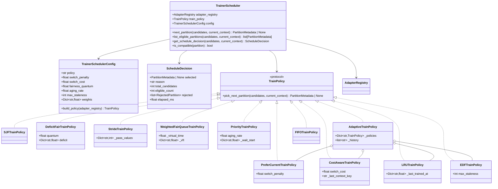

# TrainerScheduler Spec

## 1. 背景与目标

### 1.1 定位

`TrainerScheduler` 是异步 RL pipeline 中训练侧的调度决策组件。它从 `TransferQueueDataPlane` 提供的 `TRAIN_READY` partition 候选集合中，选择下一个要训练的 `train_k`，并交给 `TrainerWorker` 执行。

```text
位置: src/twinkle_agentic/async_rl/scheduler.py（从 workers.py 拆出）
依赖: AdapterRegistry, TransferQueueDataPlane, scheduling policies
导出: twinkle_agentic.async_rl.TrainerScheduler
```

### 1.2 与上下游的关系

```text
TransferQueueDataPlane.list_train_ready_partitions()
  -> TrainerScheduler.next_partition(candidates, current_context)
    -> TrainerWorker.step()
      -> train_partition_fn(context, partition_id, dataloader)
```

`TrainerScheduler` 不读取 TQ 数据，不执行训练，不同步权重。它只做一件事：**在合法的候选 partition 中选择下一个**。

### 1.3 设计目标

1. **完整 gating**：所有调度决策必须先经过完整的合法性过滤，公平策略不能绕过 staleness，吞吐策略不能绕过租户隔离。
2. **策略可插拔**：支持 `prefer_current`（吞吐优先）、`fair`（公平优先）、`fifo`（先进先出）三种内置策略，并允许用户自定义。
3. **multi-LoRA 感知**：调度决策必须感知当前 adapter 的训练状态、权重同步状态和 LoRA 切换成本。
4. **可观测**：调度决策过程应可追溯，支持 debug 和 metrics。
5. **独立文件**：从 `workers.py` 拆出到 `scheduler.py`，与 `scheduling.py`（策略实现）形成清晰的两层结构。

## 2. 当前状态分析

### 2.1 已有实现

当前 `TrainerScheduler` 在 `workers.py:280-298`，是一个 20 行的薄类：

```python
class TrainerScheduler:
    def __init__(self, *, adapter_registry, train_policy=None):
        self.adapter_registry = adapter_registry
        self.train_policy = train_policy or PreferCurrentTrainPolicy()

    def next_partition(self, candidates, current_context=None):
        filtered = []
        for partition in candidates:
            if partition.status != PartitionStatus.TRAIN_READY:
                continue
            if not self.adapter_registry.can_train(partition.context):
                continue
            filtered.append(partition)
        return self.train_policy.pick_next_partition(filtered, current_context)
```

已有策略（`scheduling.py`）：
- `PreferCurrentTrainPolicy`：优先当前 adapter，否则选 ready partition 最多的 adapter
- `DeficitFairTrainPolicy`：加权 deficit round-robin

### 2.2 缺失项

| 缺失 | 说明 | 设计文档引用 |
|------|------|-------------|
| 独立文件 | 当前嵌在 `workers.py` 中，不利于维护和测试 | 开发者 A 分工 |
| 策略种类不足 | 仅有 `prefer_current` 和 `fair` 两种，缺少 LRU、stride、cost-aware、EDF、priority、adaptive 等高性能策略 | 多租户设计 4.2 |
| FIFO 策略 | 设计文档提到 `fifo` 作为可选项，未实现 | 多租户设计 4.3 |
| switch_penalty | 切换 adapter 的惩罚参数，未实现 | 多租户设计 4.3 YAML 配置 |
| 切换成本建模 | 无显式 LoRA 切换成本建模（S-LoRA 思想） | - |
| 确定性公平调度 | 无 stride / WFQ 等确定性比例份额调度 | - |
| 新鲜度感知 | 无 LRU / EDF 等基于 staleness 的调度 | - |
| 自适应策略 | 无根据负载动态切换策略的能力 | - |
| reward_type / loss_type / algorithm 匹配校验 | gating 第 5 条未实现 | 多租户设计 4.2 |
| 调度可观测性 | 无日志、无 metrics、无决策 trace | - |
| 权重感知 | `DeficitFairTrainPolicy` 中 weight 硬编码 1.0，未从 `AdapterRecord` 读取 | 多租户设计 4.2.2 |
| 配置驱动 | 策略选择通过代码传入，未从 YAML 配置直接构建 | 多租户设计 4.3 |
| 完整 gating 文档 | gating 条件散落在设计文档中，未在代码中显式表达 | 多租户设计 4.2 |

## 3. 类图设计



## 4. Gating 设计

### 4.1 Gating 条件

`TrainerScheduler` 的 gating 分为五层，按顺序执行。任何一层不通过即拒绝该 partition：

```text
G1: partition.status == TRAIN_READY
    数据必须已经完成 rollout、reward、advantage 三个阶段。

G2: partition 内 metadata 同属一个 TrainingContext
    partition.context.key 必须完整且合法。
    （由 TransferQueueDataPlane 保证，此处做防御性校验。）

G3: AdapterRegistry.can_train(context) 通过
    adapter.state == ACTIVE
    and not adapter.sync_in_progress
    and adapter.training_partition is None

G4: adapter 不在终态
    adapter.state not in (FAILED, CANCELLED, DRAINING)

G5: train_k 的 reward_type / loss_type / algorithm 与 trainer 可执行配置匹配
    第一版 trainer 支持所有 reward_type / loss_type / algorithm，
    此条作为预留钩子，允许子类覆盖 is_compatible() 方法。
```

### 4.2 Gating 结果

每个被拒绝的 partition 记录拒绝原因，用于 `ScheduleDecision`：

```python
@dataclass(frozen=True)
class RejectedPartition:
    partition_id: str
    context_key: str
    reason: str  # 'not_train_ready' | 'cannot_train' | 'adapter_terminal_state' | 'incompatible'
```

### 4.3 is_compatible 钩子

```python
class TrainerScheduler:
    def is_compatible(self, partition: PartitionMetadata) -> bool:
        """判断 partition 的 reward_type / loss_type / algorithm 是否与当前 trainer 兼容。

        第一版默认返回 True。子类可覆盖以实现自定义过滤。
        """
        return True
```

## 5. 调度策略设计

### 5.0 策略总览与分类

调度策略按优化目标分为四类：

| 类别 | 策略 | 核心优化目标 | 适用场景 |
|------|------|-------------|---------|
| 吞吐优先 | `prefer_current` | 减少 LoRA 切换开销和 trainer 空泡 | 单租户或少 adapter |
| 吞吐优先 | `cost_aware` | 显式建模切换成本，批量训练同 adapter | 多 adapter 且切换成本高 |
| 吞吐优先 | `sjf` | 减少平均完成时间 | partition 大小差异大 |
| 公平优先 | `fair` (deficit round-robin) | 按权重分配训练机会 | 多租户 SLA |
| 公平优先 | `stride` | 确定性比例份额调度 | 需要可预测的公平性 |
| 公平优先 | `weighted_fair_queuing` | 加权公平排队，隔离延迟 | 需要延迟隔离 |
| 新鲜度优先 | `lru` | 减少 adapter 权重老化 | rollout 产生快、需要尽快训练 |
| 新鲜度优先 | `edf` | 避免 staleness 越界 | max_staleness 较小时 |
| 优先级 | `priority` | 按租户 SLA 等级区分 | 多租户分层服务 |
| 自适应 | `adaptive` | 根据系统负载动态切换策略 | 负载波动大的生产环境 |
| 简单 | `fifo` | 先进先出，无状态 | 单租户或调试 |

### 5.1 策略协议

所有 train policy 必须实现以下接口（duck-typed，不强制继承）：

```python
class TrainPolicy(Protocol):
    def pick_next_partition(
        self,
        candidates: list[PartitionMetadata],
        current_context: Optional[TrainingContext] = None,
    ) -> Optional[PartitionMetadata]:
        ...
```

部分策略需要额外上下文（如 `AdapterRegistry`、`StalenessManager`），通过构造函数注入。

### 5.2 PreferCurrentTrainPolicy（吞吐优先 / 亲和优先）

**来源**：多租户设计文档 4.2.1。

**目标**：减少 trainer 空泡和 LoRA 切换成本。

**核心思想**：尽量留在当前 adapter 上继续训练，避免不必要的 LoRA 切换。只有当前 adapter 没有 ready 数据时才切换。

**规则**：

```text
1. 如果 current_context 有 TRAIN_READY partition，继续训练当前 adapter。
2. 如果 current_context 没有 TRAIN_READY partition，立即切到其他 ready adapter。
3. 多个 adapter 都 ready 时，选择 ready_partition_count 最多的 adapter。
4. 同分时选择 oldest train_k。
```

**switch_penalty 扩展**：

当 `switch_penalty > 0` 时，切换到不同 adapter 需要满足额外条件：

```text
如果 current_context 不为 None 且 current_context 没有 TRAIN_READY partition：
  只有当其他 adapter 的 ready_partition_count >= switch_penalty 时才切换。
  否则返回 None（trainer 等待当前 adapter 产生新数据）。
```

`switch_penalty = 0` 时退化为原始行为（立即切换）。

**性能特征**：

```text
优势: LoRA 切换次数最少，单 adapter 吞吐最高。
劣势: 可能导致其他 adapter 饥饿。
适用: adapter 数量少（2-4 个），或切换成本远大于训练时间。
```

### 5.3 CostAwareTrainPolicy（切换成本感知）

**来源**：S-LoRA (2023) 的 adapter batching 思想 + LoRA 切换开销建模。

**目标**：显式建模 LoRA 切换成本，在切换开销和训练吞吐之间找到最优平衡。

**核心思想**：每次切换 adapter 都有固定开销（加载权重、刷新 KV cache、flush optimizer state）。策略应该尽量把同一个 adapter 的多个 partition 连续训练完再切换，类似于批处理中的 job batching。

**算法**：

```python
class CostAwareTrainPolicy:
    def __init__(
        self,
        switch_cost: float = 1.0,
        adapter_registry: Optional[AdapterRegistry] = None,
    ):
        self.switch_cost = switch_cost
        self.adapter_registry = adapter_registry
        self._last_context_key: Optional[str] = None
        self._consecutive_count: int = 0

    def pick_next_partition(self, candidates, current_context=None):
        if not candidates:
            return None

        grouped = defaultdict(list)
        for p in candidates:
            grouped[p.context.key].append(p)

        current_key = current_context.key if current_context else self._last_context_key

        if current_key and current_key in grouped:
            same = grouped[current_key]
            self._consecutive_count += 1
            self._last_context_key = current_key
            return _oldest_partition(same)

        best_key = None
        best_score = -float('inf')
        for key, partitions in grouped.items():
            benefit = len(partitions)
            cost = self.switch_cost if key != current_key else 0.0
            score = benefit - cost
            if score > best_score:
                best_score = score
                best_key = key

        if best_key is None:
            return None

        self._last_context_key = best_key
        self._consecutive_count = 1
        return _oldest_partition(grouped[best_key])
```

**关键参数**：

| 参数 | 含义 | 建议值 |
|------|------|--------|
| `switch_cost` | 一次 LoRA 切换的等效成本（以 partition 数为单位） | `1.0` 到 `3.0`，取决于 adapter 大小和加载速度 |

**性能特征**：

```text
优势: 在切换成本高时显著优于 FIFO 和 fair。自动形成同 adapter 批量训练。
劣势: 低负载时可能过度保守（不愿切换）。
适用: adapter 数量中等（4-16 个），切换开销可测量。
```

### 5.4 SJFTrainPolicy（最短作业优先）

**来源**：OS 调度经典算法 + Gandiva/Tiresias 中的 small-job-first 策略。

**目标**：最小化平均 partition 完成时间（average completion time）。

**核心思想**：优先训练数据量最小的 partition。小 partition 快速完成后释放 adapter 训练槽位，让更多 adapter 参与调度。

**算法**：

```python
class SJFTrainPolicy:
    def pick_next_partition(self, candidates, current_context=None):
        if not candidates:
            return None
        return min(candidates, key=lambda p: (p.num_rows, p.created_at, p.partition_id))
```

**性能特征**：

```text
优势: 平均完成时间最优（理论最优）。小任务快速完成，提高系统响应性。
劣势: 大 partition 可能饥饿（convoy effect）。不考虑 adapter 亲和性。
适用: partition 大小差异大（如不同 target_groups 配置），且关注响应时间。
缓解: 可结合 aging 机制，长时间等待的 partition 逐渐提升优先级。
```

### 5.5 DeficitFairTrainPolicy（公平优先 / Deficit Round-Robin）

**来源**：DRR (Shreedhar & Varghese, 1996) + 多租户设计文档 4.2.2。

**目标**：不同 tenant / LoRA 按权重获得训练机会。

**规则**：

```text
1. 按 context.key 分组。
2. 按 round-robin 顺序遍历各组。
3. 每轮给每个 context 增加 weight * quantum 的 deficit。
4. 选择第一个 deficit >= cost 的 context。
5. 从该 context 中选择 oldest partition。
```

**weight 来源**：

```python
weights[context.key] = adapter_registry.get(context.key).weight
```

**cost 单位**：第一版固定为 `1 train_k`。后续可改为 `num_rows` 或 `optimizer_step_count`。

**性能特征**：

```text
优势: O(1) 调度开销。长期公平性保证。支持权重差异化。
劣势: 短期可能不公平（取决于 quantum 大小）。不考虑切换成本。
适用: 多租户 SLA 场景，需要可量化的公平性保证。
```

### 5.6 StrideTrainPolicy（确定性比例份额调度）

**来源**：Stride Scheduling (Waldspurger & Weihl, 1995)，Xen hypervisor 的 credit scheduler。

**目标**：提供确定性的比例份额调度，比 lottery scheduling 更可预测，比 DRR 更平滑。

**核心思想**：每个 adapter 有一个 `stride`（步长，与权重成反比）和一个 `pass_value`（累计值）。每次调度选择 `pass_value` 最小的 adapter，然后给它加上 `stride`。权重越大的 adapter，stride 越小，pass_value 增长越慢，被选中的频率越高。

**算法**：

```python
class StrideTrainPolicy:
    STRIDE_UNIT = 1000000

    def __init__(
        self,
        adapter_registry: Optional[AdapterRegistry] = None,
        weights: Optional[Dict[str, float]] = None,
    ):
        self.adapter_registry = adapter_registry
        self.weights = weights or {}
        self._pass_values: Dict[str, int] = defaultdict(int)

    def _get_stride(self, context_key: str) -> int:
        weight = self.weights.get(context_key, 1.0)
        if self.adapter_registry is not None:
            try:
                weight = self.adapter_registry.get(context_key).weight
            except KeyError:
                pass
        if weight <= 0:
            weight = 0.01
        return int(self.STRIDE_UNIT / weight)

    def pick_next_partition(self, candidates, current_context=None):
        if not candidates:
            return None

        grouped = defaultdict(list)
        for p in candidates:
            grouped[p.context.key].append(p)

        best_key = min(grouped.keys(), key=lambda k: self._pass_values[k])
        self._pass_values[best_key] += self._get_stride(best_key)
        return _oldest_partition(grouped[best_key])
```

**性能特征**：

```text
优势: 确定性公平（无随机性）。任意时刻的份额误差有上界。
      权重变化时平滑过渡。被 Xen/KVM 验证可用于生产。
劣势: 需要维护 per-adapter 状态。新 adapter 加入时 pass_value 初始化需要策略。
适用: 需要严格可预测的公平性保证，如多租户计费场景。
```

**新 adapter 加入处理**：

```python
def on_adapter_registered(self, context_key: str):
    if self._pass_values:
        self._pass_values[context_key] = max(self._pass_values.values())
    else:
        self._pass_values[context_key] = 0
```

### 5.7 WeightedFairQueueTrainPolicy（加权公平排队）

**来源**：WFQ (Demers, Keshav, Shenker, 1989)，网络调度中的 GPS 近似。

**目标**：提供加权公平排队的同时，隔离不同 adapter 的延迟。高权重 adapter 不仅获得更多份额，还获得更低的调度延迟。

**核心思想**：模拟 Generalized Processor Sharing (GPS) 理想模型。每个 adapter 维护一个 virtual finish time (VFT)。每次选择 VFT 最小的 adapter。VFT 的增长速率与权重成反比。

**算法**：

```python
class WeightedFairQueueTrainPolicy:
    def __init__(
        self,
        adapter_registry: Optional[AdapterRegistry] = None,
        weights: Optional[Dict[str, float]] = None,
    ):
        self.adapter_registry = adapter_registry
        self.weights = weights or {}
        self._virtual_time: float = 0.0
        self._vft: Dict[str, float] = {}

    def _get_weight(self, context_key: str) -> float:
        if context_key in self.weights:
            return self.weights[context_key]
        if self.adapter_registry is not None:
            try:
                return self.adapter_registry.get(context_key).weight
            except KeyError:
                pass
        return 1.0

    def _total_weight(self, active_keys) -> float:
        return sum(self._get_weight(k) for k in active_keys)

    def pick_next_partition(self, candidates, current_context=None):
        if not candidates:
            return None

        grouped = defaultdict(list)
        for p in candidates:
            grouped[p.context.key].append(p)

        active_keys = list(grouped.keys())
        total_w = self._total_weight(active_keys)

        for key in active_keys:
            if key not in self._vft:
                self._vft[key] = self._virtual_time

        best_key = min(active_keys, key=lambda k: self._vft[k])
        w = self._get_weight(best_key)
        self._vft[best_key] += 1.0 / w
        self._virtual_time += 1.0 / total_w

        return _oldest_partition(grouped[best_key])
```

**性能特征**：

```text
优势: 同时保证公平性和延迟隔离。高权重 adapter 获得更低延迟。
      被网络路由器广泛验证。
劣势: 计算开销略高于 stride（需要维护 virtual time）。
适用: 需要延迟 SLA 的多租户场景（如高优租户需要更快响应）。
```

### 5.8 LRUTrainPolicy（最近最少使用）

**来源**：CPU cache replacement + S-LoRA 的 adapter eviction 策略。

**目标**：优先训练最近没有被训练过的 adapter，确保所有活跃 adapter 的权重保持"新鲜"。

**核心思想**：维护每个 adapter 的 `last_trained_at` 时间戳。每次选择 `last_trained_at` 最早的 adapter。这样可以避免某个 adapter 长时间不被训练导致其 rollout 数据过度 stale。

**算法**：

```python
class LRUTrainPolicy:
    def __init__(self):
        self._last_trained_at: Dict[str, float] = {}

    def pick_next_partition(self, candidates, current_context=None):
        if not candidates:
            return None

        grouped = defaultdict(list)
        for p in candidates:
            grouped[p.context.key].append(p)

        now = time.time()
        best_key = min(
            grouped.keys(),
            key=lambda k: self._last_trained_at.get(k, 0.0),
        )
        self._last_trained_at[best_key] = now
        return _oldest_partition(grouped[best_key])
```

**性能特征**：

```text
优势: 自动防止 adapter 饥饿。简单高效，O(n) 复杂度。
      与 rollout 侧的 staleness 控制自然对齐。
劣势: 不考虑 partition 数量差异（一个有 5 个 ready partition 的 adapter
      和一个只有 1 个的 adapter 被同等对待）。
适用: adapter 数量多（>8 个），且需要确保所有 adapter 定期被训练。
```

**与 staleness 的关系**：

LRU 策略天然与 `StalenessManager` 的 `max_staleness` 配合。如果某个 adapter 长时间不被训练，其 live partitions 会堆积，触发 rollout 侧 throttle/sleep。LRU 确保最久没训练的 adapter 优先被消费，释放 capacity。

### 5.9 EDFTrainPolicy（最早截止时间优先）

**来源**：实时系统调度 (Liu & Layland, 1973) + async RL staleness 约束。

**目标**：避免任何 partition 违反 staleness 约束。优先训练最"紧急"的 partition。

**核心思想**：每个 partition 有一个隐含的 deadline——如果它不被及时训练，对应的 adapter 的 rollout 侧会因为 staleness 越界而被阻塞。deadline 越近的 partition 越优先。

**deadline 计算**：

```text
partition 的 urgency 由以下因素决定：
  1. partition 的 created_at（越老越紧急）
  2. 同 adapter 的 live_partition_count（越多越紧急，因为接近 max_staleness 上限）
  3. 同 adapter 的 in_flight_rollouts（越多越紧急，因为 rollout 在等待 capacity）
```

**算法**：

```python
class EDFTrainPolicy:
    def __init__(
        self,
        max_staleness: int = 1,
        adapter_registry: Optional[AdapterRegistry] = None,
    ):
        self.max_staleness = max_staleness
        self.adapter_registry = adapter_registry

    def _compute_urgency(self, partition: PartitionMetadata) -> float:
        score = 0.0
        score += (time.time() - partition.created_at)
        if self.adapter_registry is not None:
            try:
                record = self.adapter_registry.get(partition.context)
                live_count = len(record.live_partitions)
                max_live = self.max_staleness + 1
                score += (live_count / max_live) * 100.0
                score += record.in_flight_rollouts * 10.0
            except KeyError:
                pass
        return -score

    def pick_next_partition(self, candidates, current_context=None):
        if not candidates:
            return None
        return min(candidates, key=lambda p: self._compute_urgency(p))
```

**性能特征**：

```text
优势: 最小化 staleness 越界概率。在 max_staleness 较小时特别有效。
      与 rollout 侧的背压机制形成闭环。
劣势: 可能频繁切换 adapter（如果多个 adapter 的 urgency 接近）。
      不考虑切换成本。
适用: max_staleness=0 或 1 的严格异步场景，或 rollout 产生速度远快于训练。
```

### 5.10 PriorityTrainPolicy（优先级 + Aging）

**来源**：OS 多级优先级调度 + Unix nice 值 + MLFQ aging。

**目标**：支持多租户分层 SLA（如金牌/银牌/铜牌），同时通过 aging 防止低优先级 adapter 饥饿。

**核心思想**：每个 adapter 有一个静态优先级（来自配置或 `AdapterRecord.weight`）。高优先级 adapter 优先被调度。但长时间等待的低优先级 adapter 会逐渐提升优先级（aging），最终获得训练机会。

**算法**：

```python
class PriorityTrainPolicy:
    def __init__(
        self,
        aging_rate: float = 0.1,
        adapter_registry: Optional[AdapterRegistry] = None,
        weights: Optional[Dict[str, float]] = None,
    ):
        self.aging_rate = aging_rate
        self.adapter_registry = adapter_registry
        self.weights = weights or {}
        self._wait_start: Dict[str, float] = {}

    def _get_priority(self, context_key: str) -> float:
        if context_key in self.weights:
            return self.weights[context_key]
        if self.adapter_registry is not None:
            try:
                return self.adapter_registry.get(context_key).weight
            except KeyError:
                pass
        return 1.0

    def _effective_priority(self, context_key: str, now: float) -> float:
        base_priority = self._get_priority(context_key)
        wait_time = now - self._wait_start.get(context_key, now)
        return base_priority + wait_time * self.aging_rate

    def pick_next_partition(self, candidates, current_context=None):
        if not candidates:
            return None

        now = time.time()
        grouped = defaultdict(list)
        for p in candidates:
            grouped[p.context.key].append(p)
            if p.context.key not in self._wait_start:
                self._wait_start[p.context.key] = p.created_at

        best_key = max(
            grouped.keys(),
            key=lambda k: self._effective_priority(k, now),
        )
        self._wait_start.pop(best_key, None)
        return _oldest_partition(grouped[best_key])
```

**关键参数**：

| 参数 | 含义 | 建议值 |
|------|------|--------|
| `aging_rate` | 每秒增加的优先级。值越大，低优先级 adapter 提升越快 | `0.01` ~ `1.0` |

**性能特征**：

```text
优势: 支持分层 SLA。aging 防止饥饿。灵活且直觉。
劣势: aging_rate 需要调参。极端情况下高优任务可能被 aging 后的低优任务抢占。
适用: 多租户分层服务（如免费/付费/企业版），需要差异化 SLA。
```

### 5.11 AdaptiveTrainPolicy（自适应混合策略）

**来源**：MLFQ (Corbato et al., 1962) + Linux CFS 的自适应思想 + Pollux 的动态策略切换。

**目标**：根据系统负载自动切换调度策略，在不同阶段使用最适合的策略。

**核心思想**：监控系统状态（ready partition 数量、adapter 利用率、切换频率），在不同策略之间动态切换：

```text
低负载（ready partitions < adapter 数量）:
  使用 prefer_current，减少切换开销。

中负载（ready partitions ≈ adapter 数量 × 2）:
  使用 cost_aware，平衡切换成本和公平性。

高负载（ready partitions >> adapter 数量）:
  使用 lru 或 edf，确保所有 adapter 都能被训练到，避免 staleness 越界。

切换频率过高（最近 N 次调度中切换比例 > 阈值）:
  临时使用 prefer_current 或 cost_aware 来降低切换频率。
```

**算法**：

```python
class AdaptiveTrainPolicy:
    def __init__(
        self,
        adapter_registry: Optional[AdapterRegistry] = None,
        max_staleness: int = 1,
        switch_cost: float = 1.0,
        high_load_threshold: float = 3.0,
        switch_rate_threshold: float = 0.7,
        window_size: int = 20,
    ):
        self.adapter_registry = adapter_registry
        self.max_staleness = max_staleness
        self._policies = {
            'prefer_current': PreferCurrentTrainPolicy(),
            'cost_aware': CostAwareTrainPolicy(switch_cost=switch_cost, adapter_registry=adapter_registry),
            'lru': LRUTrainPolicy(),
            'edf': EDFTrainPolicy(max_staleness=max_staleness, adapter_registry=adapter_registry),
        }
        self._current_policy_name = 'prefer_current'
        self._history: list[str] = []
        self._window_size = window_size
        self._high_load_threshold = high_load_threshold
        self._switch_rate_threshold = switch_rate_threshold

    def _select_policy_name(self, candidates, current_context) -> str:
        n_candidates = len(candidates)
        n_adapters = len(set(p.context.key for p in candidates)) if candidates else 0

        if n_adapters == 0:
            return 'prefer_current'

        load_ratio = n_candidates / max(n_adapters, 1)

        if len(self._history) >= self._window_size:
            recent = self._history[-self._window_size:]
            switch_count = sum(1 for i in range(1, len(recent)) if recent[i] != recent[i-1])
            switch_rate = switch_count / (self._window_size - 1)
            if switch_rate > self._switch_rate_threshold:
                return 'prefer_current'

        if load_ratio >= self._high_load_threshold:
            return 'edf'
        elif load_ratio >= 1.5:
            return 'cost_aware'
        else:
            return 'prefer_current'

    def pick_next_partition(self, candidates, current_context=None):
        if not candidates:
            return None
        policy_name = self._select_policy_name(candidates, current_context)
        self._current_policy_name = policy_name
        self._history.append(policy_name)
        return self._policies[policy_name].pick_next_partition(candidates, current_context)
```

**性能特征**：

```text
优势: 自动适应负载变化。无需手动选择策略。在负载波动大的场景下表现稳健。
劣势: 实现复杂度高。策略切换时可能出现短暂的不一致行为。
      需要足够的历史数据才能做出好的决策。
适用: 生产环境，负载波动大，运维团队不希望手动调参。
```

### 5.12 FIFOTrainPolicy（先进先出）

**目标**：严格按 partition 创建时间排序，不考虑 adapter 亲和性。

**规则**：

```text
1. 将所有 eligible partition 按 (created_at, partition_id) 排序。
2. 选择最老的 partition。
```

**性能特征**：

```text
优势: 无状态，最简单。保证不会饥饿。
劣势: 完全忽略 adapter 亲和性，切换开销最大。
适用: 单租户、调试、或作为其他策略的 baseline。
```

### 5.13 策略选型指南

```text
                    ┌─────────────────────────────────────────────┐
                    │          你的场景是什么？                      │
                    └──────────────┬──────────────────────────────┘
                                   │
                    ┌──────────────┴──────────────┐
                    │                             │
              单租户/少 adapter              多租户/多 adapter
                    │                             │
           ┌────────┴────────┐          ┌─────────┴─────────┐
           │                 │          │                   │
     切换成本高          切换成本低    需要公平性          不需要公平性
           │                 │          │                   │
    prefer_current      sjf/fifo    ┌───┴───┐          cost_aware
                                    │       │
                              可预测    延迟隔离
                              公平性    需求
                                │       │
                            stride    wfq
                                │
                          ┌─────┴─────┐
                          │           │
                     分层 SLA     负载波动大
                          │           │
                     priority    adaptive
                          │
                    ┌─────┴─────┐
                    │           │
               需要防饥饿    需要防staleness
                    │           │
                   lru         edf
```

**快速推荐表**：

| 场景 | 推荐策略 | 理由 |
|------|---------|------|
| 单 adapter 训练 | `fifo` | 最简单，无切换 |
| 2-4 个 adapter，追求吞吐 | `prefer_current` | 切换最少 |
| 4-16 个 adapter，切换成本高 | `cost_aware` | 显式建模切换开销 |
| 多租户 SLA，需要公平 | `stride` 或 `fair` | 可量化的公平性 |
| 多租户分层（金牌/银牌） | `priority` | 差异化优先级 |
| adapter 数量多，防饥饿 | `lru` | 自动轮转 |
| max_staleness 小，防越界 | `edf` | 优先紧急 partition |
| 负载波动大，不想调参 | `adaptive` | 自动适应 |
| 需要延迟隔离 | `wfq` | 高权重 = 低延迟 |
| partition 大小差异大 | `sjf` | 最优平均完成时间 |

### 5.14 策略配置

```yaml
multi_lora:
  train_schedule:
    policy: prefer_current
    # prefer_current | cost_aware | sjf | fair | stride | wfq | lru | edf | priority | adaptive | fifo
    fairness_unit: partition        # partition | row（第一版只支持 partition）
    switch_penalty: 0.0             # prefer_current 的切换惩罚
    switch_cost: 1.0                # cost_aware 的切换成本
    fairness_quantum: 1.0           # fair 策略的 quantum
    aging_rate: 0.1                 # priority 策略的 aging 速率
    max_staleness: 1                # edf / adaptive 的 staleness 上限
    adaptive_high_load_threshold: 3.0   # adaptive 策略的高负载阈值
    adaptive_switch_rate_threshold: 0.7 # adaptive 策略的切换频率阈值
    weights:                        # 可选的 per-adapter 权重覆盖
      tenant_a/code_lora: 1.0
      tenant_b/math_lora: 2.0
```

## 6. TrainerSchedulerConfig

```python
@dataclass
class TrainerSchedulerConfig:
    policy: str = 'prefer_current'
    switch_penalty: float = 0.0
    switch_cost: float = 1.0
    fairness_quantum: float = 1.0
    aging_rate: float = 0.1
    max_staleness: int = 1
    adaptive_high_load_threshold: float = 3.0
    adaptive_switch_rate_threshold: float = 0.7
    weights: Dict[str, float] = field(default_factory=dict)
    fairness_unit: str = 'partition'

    def build_policy(self, adapter_registry: AdapterRegistry) -> 'TrainPolicy':
        if self.policy == 'prefer_current':
            return PreferCurrentTrainPolicy(switch_penalty=self.switch_penalty)
        elif self.policy == 'cost_aware':
            return CostAwareTrainPolicy(
                switch_cost=self.switch_cost,
                adapter_registry=adapter_registry,
            )
        elif self.policy == 'sjf':
            return SJFTrainPolicy()
        elif self.policy == 'fair':
            return DeficitFairTrainPolicy(
                quantum=self.fairness_quantum,
                adapter_registry=adapter_registry,
                weights=self.weights,
            )
        elif self.policy == 'stride':
            return StrideTrainPolicy(
                adapter_registry=adapter_registry,
                weights=self.weights,
            )
        elif self.policy == 'wfq':
            return WeightedFairQueueTrainPolicy(
                adapter_registry=adapter_registry,
                weights=self.weights,
            )
        elif self.policy == 'lru':
            return LRUTrainPolicy()
        elif self.policy == 'edf':
            return EDFTrainPolicy(
                max_staleness=self.max_staleness,
                adapter_registry=adapter_registry,
            )
        elif self.policy == 'priority':
            return PriorityTrainPolicy(
                aging_rate=self.aging_rate,
                adapter_registry=adapter_registry,
                weights=self.weights,
            )
        elif self.policy == 'adaptive':
            return AdaptiveTrainPolicy(
                adapter_registry=adapter_registry,
                max_staleness=self.max_staleness,
                switch_cost=self.switch_cost,
                high_load_threshold=self.adaptive_high_load_threshold,
                switch_rate_threshold=self.adaptive_switch_rate_threshold,
            )
        elif self.policy == 'fifo':
            return FIFOTrainPolicy()
        else:
            raise ValueError(f'unknown train schedule policy: {self.policy}')
```

## 7. ScheduleDecision

用于可观测性和调试：

```python
@dataclass(frozen=True)
class ScheduleDecision:
    selected: Optional[PartitionMetadata]
    reason: str
    total_candidates: int
    eligible_count: int
    rejected: list[RejectedPartition]
    elapsed_ms: float
```

`reason` 取值：

| reason | 含义 |
|--------|------|
| `selected` | 成功选中一个 partition |
| `no_candidates` | `list_train_ready_partitions()` 返回空 |
| `all_rejected` | 有候选但全部被 gating 过滤 |
| `policy_returned_none` | gating 通过但策略返回 None（如 switch_penalty 阻止切换） |

## 8. TrainerScheduler 完整 API

```python
class TrainerScheduler:

    def __init__(
        self,
        *,
        adapter_registry: AdapterRegistry,
        train_policy: Optional[TrainPolicy] = None,
        config: Optional[TrainerSchedulerConfig] = None,
    ):
        self.adapter_registry = adapter_registry
        self.config = config or TrainerSchedulerConfig()
        self.train_policy = train_policy or self.config.build_policy(adapter_registry)

    def next_partition(
        self,
        candidates: list[PartitionMetadata],
        current_context: Optional[TrainingContext] = None,
    ) -> Optional[PartitionMetadata]:
        """选择下一个要训练的 partition。

        1. 执行完整 gating 过滤。
        2. 委托给 train_policy 选择。
        3. 返回 PartitionMetadata 或 None。
        """

    def list_eligible_partitions(
        self,
        candidates: list[PartitionMetadata],
        current_context: Optional[TrainingContext] = None,
    ) -> list[PartitionMetadata]:
        """返回通过 gating 的 partition 列表，不执行策略选择。

        用于调试和 metrics。
        """

    def get_schedule_decision(
        self,
        candidates: list[PartitionMetadata],
        current_context: Optional[TrainingContext] = None,
    ) -> ScheduleDecision:
        """执行完整调度并返回决策详情。

        包含选中结果、拒绝原因、耗时等。
        用于日志和 metrics 上报。
        """

    def is_compatible(self, partition: PartitionMetadata) -> bool:
        """判断 partition 是否与当前 trainer 兼容。

        第一版默认返回 True。子类可覆盖。
        """
```

## 9. 内部实现

### 9.1 gating 实现

```python
def _apply_gating(
    self,
    candidates: list[PartitionMetadata],
) -> tuple[list[PartitionMetadata], list[RejectedPartition]]:
    eligible = []
    rejected = []

    for partition in candidates:
        if partition.status != PartitionStatus.TRAIN_READY:
            rejected.append(RejectedPartition(
                partition_id=partition.partition_id,
                context_key=partition.context.key,
                reason='not_train_ready',
            ))
            continue

        try:
            record = self.adapter_registry.get(partition.context)
        except KeyError:
            rejected.append(RejectedPartition(
                partition_id=partition.partition_id,
                context_key=partition.context.key,
                reason='unknown_adapter',
            ))
            continue

        if record.state in (AdapterState.FAILED, AdapterState.CANCELLED, AdapterState.DRAINING):
            rejected.append(RejectedPartition(
                partition_id=partition.partition_id,
                context_key=partition.context.key,
                reason='adapter_terminal_state',
            ))
            continue

        if not self.adapter_registry.can_train(partition.context):
            rejected.append(RejectedPartition(
                partition_id=partition.partition_id,
                context_key=partition.context.key,
                reason='cannot_train',
            ))
            continue

        if not self.is_compatible(partition):
            rejected.append(RejectedPartition(
                partition_id=partition.partition_id,
                context_key=partition.context.key,
                reason='incompatible',
            ))
            continue

        eligible.append(partition)

    return eligible, rejected
```

### 9.2 next_partition 实现

```python
def next_partition(self, candidates, current_context=None):
    if not candidates:
        return None
    eligible, _ = self._apply_gating(candidates)
    if not eligible:
        return None
    return self.train_policy.pick_next_partition(eligible, current_context)
```

### 9.3 get_schedule_decision 实现

```python
def get_schedule_decision(self, candidates, current_context=None):
    t0 = time.monotonic()
    total = len(candidates)

    if not candidates:
        return ScheduleDecision(
            selected=None, reason='no_candidates',
            total_candidates=0, eligible_count=0,
            rejected=[], elapsed_ms=_elapsed(t0),
        )

    eligible, rejected = self._apply_gating(candidates)

    if not eligible:
        return ScheduleDecision(
            selected=None, reason='all_rejected',
            total_candidates=total, eligible_count=0,
            rejected=rejected, elapsed_ms=_elapsed(t0),
        )

    selected = self.train_policy.pick_next_partition(eligible, current_context)
    reason = 'selected' if selected is not None else 'policy_returned_none'

    return ScheduleDecision(
        selected=selected, reason=reason,
        total_candidates=total, eligible_count=len(eligible),
        rejected=rejected, elapsed_ms=_elapsed(t0),
    )
```

## 10. 策略实现清单

所有策略实现位于 `scheduling.py`。以下为每个策略的修改/新增状态：

| 策略 | 状态 | 说明 |
|------|------|------|
| `PreferCurrentTrainPolicy` | 修改 | 增加 `switch_penalty` 参数 |
| `CostAwareTrainPolicy` | 新增 | 切换成本感知 |
| `SJFTrainPolicy` | 新增 | 最短作业优先 |
| `DeficitFairTrainPolicy` | 修改 | 增加 `adapter_registry` 和 `weights`，从 `AdapterRecord.weight` 读取 |
| `StrideTrainPolicy` | 新增 | 确定性比例份额 |
| `WeightedFairQueueTrainPolicy` | 新增 | 加权公平排队 |
| `LRUTrainPolicy` | 新增 | 最近最少使用 |
| `EDFTrainPolicy` | 新增 | 最早截止时间优先 |
| `PriorityTrainPolicy` | 新增 | 优先级 + aging |
| `AdaptiveTrainPolicy` | 新增 | 自适应混合策略 |
| `FIFOTrainPolicy` | 新增 | 先进先出 |

### 10.1 PreferCurrentTrainPolicy 增加 switch_penalty

```python
class PreferCurrentTrainPolicy:
    def __init__(self, switch_penalty: float = 0.0):
        self.switch_penalty = switch_penalty

    def pick_next_partition(self, candidates, current_context=None):
        if not candidates:
            return None

        if current_context is not None:
            same = [p for p in candidates if p.context.key == current_context.key]
            if same:
                return _oldest_partition(same)

        grouped = defaultdict(list)
        for p in candidates:
            grouped[p.context.key].append(p)

        if self.switch_penalty > 0 and current_context is not None:
            best_group = max(grouped.values(), key=lambda g: len(g))
            if len(best_group) < self.switch_penalty:
                return None

        selected_group = max(
            grouped.values(),
            key=lambda g: (len(g), -_oldest_partition(g).created_at),
        )
        return _oldest_partition(selected_group)
```

### 10.2 CostAwareTrainPolicy

```python
class CostAwareTrainPolicy:
    def __init__(self, switch_cost: float = 1.0, adapter_registry=None):
        self.switch_cost = switch_cost
        self.adapter_registry = adapter_registry
        self._last_context_key = None

    def pick_next_partition(self, candidates, current_context=None):
        if not candidates:
            return None
        grouped = defaultdict(list)
        for p in candidates:
            grouped[p.context.key].append(p)
        current_key = current_context.key if current_context else self._last_context_key
        if current_key and current_key in grouped:
            self._last_context_key = current_key
            return _oldest_partition(grouped[current_key])
        best_key = max(
            grouped.keys(),
            key=lambda k: len(grouped[k]) - (self.switch_cost if k != current_key else 0.0),
        )
        self._last_context_key = best_key
        return _oldest_partition(grouped[best_key])
```

### 10.3 SJFTrainPolicy

```python
class SJFTrainPolicy:
    def pick_next_partition(self, candidates, current_context=None):
        if not candidates:
            return None
        return min(candidates, key=lambda p: (p.num_rows, p.created_at, p.partition_id))
```

### 10.4 DeficitFairTrainPolicy 增加 weight 来源

```python
class DeficitFairTrainPolicy:
    def __init__(self, quantum=1.0, adapter_registry=None, weights=None):
        self.quantum = quantum
        self.adapter_registry = adapter_registry
        self.weights = weights or {}
        self.deficit = defaultdict(float)
        self._cursor = 0

    def _get_weight(self, context_key):
        if context_key in self.weights:
            return self.weights[context_key]
        if self.adapter_registry is not None:
            try:
                return self.adapter_registry.get(context_key).weight
            except KeyError:
                pass
        return 1.0
```

### 10.5 StrideTrainPolicy

```python
class StrideTrainPolicy:
    STRIDE_UNIT = 1000000

    def __init__(self, adapter_registry=None, weights=None):
        self.adapter_registry = adapter_registry
        self.weights = weights or {}
        self._pass_values = defaultdict(int)

    def _get_stride(self, context_key):
        weight = self.weights.get(context_key, 1.0)
        if self.adapter_registry is not None:
            try:
                weight = self.adapter_registry.get(context_key).weight
            except KeyError:
                pass
        return int(self.STRIDE_UNIT / max(weight, 0.01))

    def pick_next_partition(self, candidates, current_context=None):
        if not candidates:
            return None
        grouped = defaultdict(list)
        for p in candidates:
            grouped[p.context.key].append(p)
        best_key = min(grouped.keys(), key=lambda k: self._pass_values[k])
        self._pass_values[best_key] += self._get_stride(best_key)
        return _oldest_partition(grouped[best_key])
```

### 10.6 WeightedFairQueueTrainPolicy

```python
class WeightedFairQueueTrainPolicy:
    def __init__(self, adapter_registry=None, weights=None):
        self.adapter_registry = adapter_registry
        self.weights = weights or {}
        self._virtual_time = 0.0
        self._vft = {}

    def _get_weight(self, context_key):
        if context_key in self.weights:
            return self.weights[context_key]
        if self.adapter_registry is not None:
            try:
                return self.adapter_registry.get(context_key).weight
            except KeyError:
                pass
        return 1.0

    def pick_next_partition(self, candidates, current_context=None):
        if not candidates:
            return None
        grouped = defaultdict(list)
        for p in candidates:
            grouped[p.context.key].append(p)
        active_keys = list(grouped.keys())
        total_w = sum(self._get_weight(k) for k in active_keys)
        for key in active_keys:
            if key not in self._vft:
                self._vft[key] = self._virtual_time
        best_key = min(active_keys, key=lambda k: self._vft[k])
        self._vft[best_key] += 1.0 / self._get_weight(best_key)
        self._virtual_time += 1.0 / total_w
        return _oldest_partition(grouped[best_key])
```

### 10.7 LRUTrainPolicy

```python
class LRUTrainPolicy:
    def __init__(self):
        self._last_trained_at = {}

    def pick_next_partition(self, candidates, current_context=None):
        if not candidates:
            return None
        grouped = defaultdict(list)
        for p in candidates:
            grouped[p.context.key].append(p)
        best_key = min(grouped.keys(), key=lambda k: self._last_trained_at.get(k, 0.0))
        self._last_trained_at[best_key] = time.time()
        return _oldest_partition(grouped[best_key])
```

### 10.8 EDFTrainPolicy

```python
class EDFTrainPolicy:
    def __init__(self, max_staleness=1, adapter_registry=None):
        self.max_staleness = max_staleness
        self.adapter_registry = adapter_registry

    def _urgency(self, partition):
        score = time.time() - partition.created_at
        if self.adapter_registry is not None:
            try:
                record = self.adapter_registry.get(partition.context)
                max_live = self.max_staleness + 1
                score += (len(record.live_partitions) / max_live) * 100.0
                score += record.in_flight_rollouts * 10.0
            except KeyError:
                pass
        return -score

    def pick_next_partition(self, candidates, current_context=None):
        if not candidates:
            return None
        return min(candidates, key=lambda p: self._urgency(p))
```

### 10.9 PriorityTrainPolicy

```python
class PriorityTrainPolicy:
    def __init__(self, aging_rate=0.1, adapter_registry=None, weights=None):
        self.aging_rate = aging_rate
        self.adapter_registry = adapter_registry
        self.weights = weights or {}
        self._wait_start = {}

    def _base_priority(self, context_key):
        if context_key in self.weights:
            return self.weights[context_key]
        if self.adapter_registry is not None:
            try:
                return self.adapter_registry.get(context_key).weight
            except KeyError:
                pass
        return 1.0

    def pick_next_partition(self, candidates, current_context=None):
        if not candidates:
            return None
        now = time.time()
        grouped = defaultdict(list)
        for p in candidates:
            grouped[p.context.key].append(p)
            if p.context.key not in self._wait_start:
                self._wait_start[p.context.key] = p.created_at
        best_key = max(
            grouped.keys(),
            key=lambda k: self._base_priority(k) + (now - self._wait_start.get(k, now)) * self.aging_rate,
        )
        self._wait_start.pop(best_key, None)
        return _oldest_partition(grouped[best_key])
```

### 10.10 AdaptiveTrainPolicy

```python
class AdaptiveTrainPolicy:
    def __init__(self, adapter_registry=None, max_staleness=1, switch_cost=1.0,
                 high_load_threshold=3.0, switch_rate_threshold=0.7, window_size=20):
        self.adapter_registry = adapter_registry
        self._policies = {
            'prefer_current': PreferCurrentTrainPolicy(),
            'cost_aware': CostAwareTrainPolicy(switch_cost=switch_cost, adapter_registry=adapter_registry),
            'lru': LRUTrainPolicy(),
            'edf': EDFTrainPolicy(max_staleness=max_staleness, adapter_registry=adapter_registry),
        }
        self._history = []
        self._window_size = window_size
        self._high_load_threshold = high_load_threshold
        self._switch_rate_threshold = switch_rate_threshold

    def pick_next_partition(self, candidates, current_context=None):
        if not candidates:
            return None
        n_adapters = len(set(p.context.key for p in candidates))
        load_ratio = len(candidates) / max(n_adapters, 1)
        if len(self._history) >= self._window_size:
            recent = self._history[-self._window_size:]
            switch_rate = sum(1 for i in range(1, len(recent)) if recent[i] != recent[i-1]) / (self._window_size - 1)
            if switch_rate > self._switch_rate_threshold:
                name = 'prefer_current'
            elif load_ratio >= self._high_load_threshold:
                name = 'edf'
            elif load_ratio >= 1.5:
                name = 'cost_aware'
            else:
                name = 'prefer_current'
        else:
            name = 'prefer_current' if load_ratio < 1.5 else 'cost_aware'
        self._history.append(name)
        return self._policies[name].pick_next_partition(candidates, current_context)
```

### 10.11 FIFOTrainPolicy

```python
class FIFOTrainPolicy:
    def pick_next_partition(self, candidates, current_context=None):
        if not candidates:
            return None
        return _oldest_partition(candidates)
```

## 11. 文件结构

```text
src/twinkle_agentic/async_rl/
  scheduler.py          # 新增：TrainerScheduler, TrainerSchedulerConfig, ScheduleDecision, RejectedPartition
  scheduling.py         # 修改：增加所有新策略，修改 PreferCurrentTrainPolicy 和 DeficitFairTrainPolicy
  workers.py            # 修改：删除 TrainerScheduler（迁移到 scheduler.py）
  __init__.py           # 修改：更新 import 路径，导出新策略类
  pipeline.py           # 修改：build_trainer_scheduler() 使用 TrainerSchedulerConfig
```

### 11.1 scheduling.py 新增导出

```python
from .scheduling import (
    PreferCurrentTrainPolicy,
    CostAwareTrainPolicy,
    SJFTrainPolicy,
    DeficitFairTrainPolicy,
    StrideTrainPolicy,
    WeightedFairQueueTrainPolicy,
    LRUTrainPolicy,
    EDFTrainPolicy,
    PriorityTrainPolicy,
    AdaptiveTrainPolicy,
    FIFOTrainPolicy,
)
```

### 11.2 scheduler.py 内容

```python
from __future__ import annotations

import time
from dataclasses import dataclass, field
from typing import Any, Dict, List, Optional

from .registry import AdapterRegistry
from .scheduling import (
    PreferCurrentTrainPolicy, CostAwareTrainPolicy, SJFTrainPolicy,
    DeficitFairTrainPolicy, StrideTrainPolicy, WeightedFairQueueTrainPolicy,
    LRUTrainPolicy, EDFTrainPolicy, PriorityTrainPolicy,
    AdaptiveTrainPolicy, FIFOTrainPolicy,
)
from .types import AdapterState, PartitionMetadata, PartitionStatus, TrainingContext


@dataclass
class TrainerSchedulerConfig:
    policy: str = 'prefer_current'
    switch_penalty: float = 0.0
    switch_cost: float = 1.0
    fairness_quantum: float = 1.0
    aging_rate: float = 0.1
    max_staleness: int = 1
    adaptive_high_load_threshold: float = 3.0
    adaptive_switch_rate_threshold: float = 0.7
    weights: Dict[str, float] = field(default_factory=dict)
    fairness_unit: str = 'partition'

    def build_policy(self, adapter_registry: AdapterRegistry):
        ...


@dataclass(frozen=True)
class RejectedPartition:
    partition_id: str
    context_key: str
    reason: str


@dataclass(frozen=True)
class ScheduleDecision:
    selected: Optional[PartitionMetadata]
    reason: str
    total_candidates: int
    eligible_count: int
    rejected: list[RejectedPartition]
    elapsed_ms: float


class TrainerScheduler:
    def __init__(self, *, adapter_registry, train_policy=None, config=None):
        ...

    def next_partition(self, candidates, current_context=None):
        ...

    def list_eligible_partitions(self, candidates, current_context=None):
        ...

    def get_schedule_decision(self, candidates, current_context=None):
        ...

    def is_compatible(self, partition):
        return True

    def _apply_gating(self, candidates):
        ...
```

### 11.2 pipeline.py 修改

```python
def build_trainer_scheduler(self, *, train_policy=None) -> TrainerScheduler:
    config = TrainerSchedulerConfig(
        policy=self.config.train_schedule_policy,
        switch_penalty=self.config.train_schedule_switch_penalty,
        switch_cost=self.config.train_schedule_switch_cost,
        fairness_quantum=self.config.train_schedule_fairness_quantum,
        aging_rate=self.config.train_schedule_aging_rate,
        max_staleness=self.config.max_staleness,
        adaptive_high_load_threshold=self.config.train_schedule_adaptive_high_load_threshold,
        adaptive_switch_rate_threshold=self.config.train_schedule_adaptive_switch_rate_threshold,
        weights=self.config.train_schedule_weights,
    )
    return TrainerScheduler(
        adapter_registry=self.adapter_registry,
        train_policy=train_policy,
        config=config,
    )
```

### 11.3 BaseRLPipelineConfig 新增字段

```python
@dataclass
class BaseRLPipelineConfig:
    # ... 已有字段 ...

    # TrainerScheduler 配置
    train_schedule_policy: str = 'prefer_current'
    train_schedule_switch_penalty: float = 0.0
    train_schedule_switch_cost: float = 1.0
    train_schedule_fairness_quantum: float = 1.0
    train_schedule_aging_rate: float = 0.1
    train_schedule_adaptive_high_load_threshold: float = 3.0
    train_schedule_adaptive_switch_rate_threshold: float = 0.7
    train_schedule_weights: Dict[str, float] = field(default_factory=dict)
```

## 12. 与 TrainerWorker 的集成

`TrainerWorker.step()` 当前直接调用 `scheduler.next_partition()`。集成方式不变：

```python
class TrainerWorker:
    def step(self):
        partition = self.scheduler.next_partition(
            self.data_plane.list_train_ready_partitions(),
            self.current_context,
        )
        if partition is None:
            return None
        # ... 训练流程 ...
```

如果 pipeline 需要 metrics 上报，可以在 `TrainerWorker.step()` 中改用 `get_schedule_decision()`：

```python
class TrainerWorker:
    def step(self):
        decision = self.scheduler.get_schedule_decision(
            self.data_plane.list_train_ready_partitions(),
            self.current_context,
        )
        if decision.selected is None:
            return None
        partition = decision.selected
        # ... 训练流程 ...
```

## 13. 配置示例

### 13.1 吞吐优先（默认）

```yaml
multi_lora:
  train_schedule:
    policy: prefer_current
    switch_penalty: 0.0
```

### 13.2 切换成本感知

```yaml
multi_lora:
  train_schedule:
    policy: cost_aware
    switch_cost: 2.0  # 一次 LoRA 切换等效于 2 个 partition 的训练成本
```

### 13.3 最短作业优先

```yaml
multi_lora:
  train_schedule:
    policy: sjf
```

### 13.4 公平调度（Deficit Round-Robin）

```yaml
multi_lora:
  train_schedule:
    policy: fair
    fairness_quantum: 1.0
    weights:
      tenant_a/code_lora: 1.0
      tenant_b/math_lora: 2.0
```

### 13.5 确定性比例份额（Stride）

```yaml
multi_lora:
  train_schedule:
    policy: stride
    weights:
      tenant_a/code_lora: 3.0  # 获得 3/5 的训练机会
      tenant_b/math_lora: 2.0  # 获得 2/5 的训练机会
```

### 13.6 加权公平排队（WFQ）

```yaml
multi_lora:
  train_schedule:
    policy: wfq
    weights:
      tenant_a/code_lora: 2.0  # 高权重 = 低调度延迟
      tenant_b/math_lora: 1.0
```

### 13.7 LRU（最近最少使用）

```yaml
multi_lora:
  train_schedule:
    policy: lru
```

### 13.8 最早截止时间优先（EDF）

```yaml
multi_lora:
  train_schedule:
    policy: edf
    max_staleness: 1
```

### 13.9 优先级 + Aging

```yaml
multi_lora:
  train_schedule:
    policy: priority
    aging_rate: 0.05  # 每秒增加 0.05 优先级，防止低优饥饿
    weights:
      tenant_a/enterprise_lora: 10.0  # 金牌客户
      tenant_b/standard_lora: 5.0     # 银牌客户
      tenant_c/free_lora: 1.0         # 免费用户
```

### 13.10 自适应混合

```yaml
multi_lora:
  train_schedule:
    policy: adaptive
    switch_cost: 1.5
    max_staleness: 2
    adaptive_high_load_threshold: 3.0
    adaptive_switch_rate_threshold: 0.7
```

### 13.11 带切换惩罚

```yaml
multi_lora:
  train_schedule:
    policy: prefer_current
    switch_penalty: 2.0  # 其他 adapter 至少有 2 个 ready partition 才切换
```

### 13.12 FIFO

```yaml
multi_lora:
  train_schedule:
    policy: fifo
```

## 14. 实现计划

### Step 1: 修改现有策略 + 新增所有策略类

**文件**: `scheduling.py`

- 修改 `PreferCurrentTrainPolicy`：增加 `switch_penalty` 参数
- 修改 `DeficitFairTrainPolicy`：增加 `adapter_registry` 和 `weights` 参数，从 `AdapterRecord.weight` 读取
- 新增 `CostAwareTrainPolicy`
- 新增 `SJFTrainPolicy`
- 新增 `StrideTrainPolicy`
- 新增 `WeightedFairQueueTrainPolicy`
- 新增 `LRUTrainPolicy`
- 新增 `EDFTrainPolicy`
- 新增 `PriorityTrainPolicy`
- 新增 `AdaptiveTrainPolicy`
- 新增 `FIFOTrainPolicy`

### Step 2: 创建 scheduler.py

**文件**: `scheduler.py`（新建）

- `TrainerSchedulerConfig`（含所有策略的 `build_policy` 分支）
- `RejectedPartition`
- `ScheduleDecision`
- `TrainerScheduler`（从 `workers.py` 迁移并增强）

### Step 3: 修改 workers.py

**文件**: `workers.py`

- 删除 `TrainerScheduler` 类定义
- 从 `scheduler.py` import `TrainerScheduler`

### Step 4: 修改 pipeline.py

**文件**: `pipeline.py`

- `BaseRLPipelineConfig` 增加 `train_schedule_*` 字段
- `build_trainer_scheduler()` 使用 `TrainerSchedulerConfig`

### Step 5: 更新 __init__.py

**文件**: `__init__.py`

- 增加所有新策略类的导出
- 增加 `TrainerSchedulerConfig`, `ScheduleDecision`, `RejectedPartition` 导出
- 更新 `TrainerScheduler` 的 import 路径

### Step 6: 测试

**文件**: `tests/twinkle_agentic/async_rl/test_scheduler.py`（新建）

- gating 测试（9 个）
- 策略测试（~40 个，覆盖 11 种策略）
- 配置测试（~14 个）
- ScheduleDecision 测试（5 个）
- 集成测试（4 个）

## 15. 测试计划

### 15.1 Gating 测试

| 测试 | 验证内容 |
|------|---------|
| `test_gating_rejects_non_train_ready` | 非 `TRAIN_READY` 状态的 partition 被过滤 |
| `test_gating_rejects_failed_adapter` | `AdapterState.FAILED` 的 adapter 被过滤 |
| `test_gating_rejects_cancelled_adapter` | `AdapterState.CANCELLED` 的 adapter 被过滤 |
| `test_gating_rejects_draining_adapter` | `AdapterState.DRAINING` 的 adapter 被过滤 |
| `test_gating_rejects_syncing_adapter` | `sync_in_progress=True` 的 adapter 被过滤 |
| `test_gating_rejects_training_adapter` | `training_partition` 不为 None 的 adapter 被过滤 |
| `test_gating_rejects_unknown_adapter` | 未在 registry 注册的 adapter 被过滤 |
| `test_gating_passes_active_adapter` | `ACTIVE` 且无冲突状态的 adapter 通过 |
| `test_is_compatible_hook` | 子类覆盖 `is_compatible()` 可以自定义过滤 |

### 15.2 策略测试

#### PreferCurrentTrainPolicy

| 测试 | 验证内容 |
|------|---------|
| `test_prefer_current_stays_on_same_adapter` | 当前 adapter 有 ready partition 时不切换 |
| `test_prefer_current_switches_when_no_ready` | 当前 adapter 无 ready partition 时切换 |
| `test_prefer_current_picks_most_ready` | 多 adapter 都 ready 时选 partition 最多的 |
| `test_prefer_current_tiebreak_oldest` | 同分时选最老的 partition |
| `test_prefer_current_switch_penalty_blocks` | switch_penalty > 0 且 ready 数不足时返回 None |
| `test_prefer_current_switch_penalty_allows` | switch_penalty > 0 且 ready 数足够时切换 |

#### CostAwareTrainPolicy

| 测试 | 验证内容 |
|------|---------|
| `test_cost_aware_stays_on_same_adapter` | 当前 adapter 有 ready partition 时不切换 |
| `test_cost_aware_picks_highest_benefit` | 切换时选 benefit - cost 最高的 adapter |
| `test_cost_aware_switch_cost_deters` | switch_cost 足够高时不切换到少 partition 的 adapter |
| `test_cost_aware_zero_cost_always_switches` | switch_cost=0 时纯按 partition 数量选择 |

#### SJFTrainPolicy

| 测试 | 验证内容 |
|------|---------|
| `test_sjf_picks_smallest_partition` | 选 num_rows 最小的 partition |
| `test_sjf_tiebreak_oldest` | num_rows 相同时选最老的 |
| `test_sjf_ignores_current_context` | 不考虑 current_context |

#### DeficitFairTrainPolicy

| 测试 | 验证内容 |
|------|---------|
| `test_fair_round_robin` | 等权重时按 round-robin 分配 |
| `test_fair_weighted` | 不等权重时按比例分配 |
| `test_fair_uses_adapter_registry_weight` | 从 AdapterRecord.weight 读取权重 |
| `test_fair_explicit_weights_override` | 显式 weights 覆盖 AdapterRecord.weight |

#### StrideTrainPolicy

| 测试 | 验证内容 |
|------|---------|
| `test_stride_equal_weight_alternates` | 等权重时交替选择 |
| `test_stride_higher_weight_more_often` | 高权重 adapter 被选中频率更高 |
| `test_stride_deterministic` | 相同输入序列产生相同调度结果 |
| `test_stride_new_adapter_initialization` | 新 adapter 加入时 pass_value 正确初始化 |

#### WeightedFairQueueTrainPolicy

| 测试 | 验证内容 |
|------|---------|
| `test_wfq_higher_weight_lower_delay` | 高权重 adapter 调度间隔更短 |
| `test_wfq_virtual_time_advances` | virtual_time 每次调度都递增 |
| `test_wfq_single_adapter_always_picks` | 只有一个 adapter 时总是选它 |

#### LRUTrainPolicy

| 测试 | 验证内容 |
|------|---------|
| `test_lru_picks_least_recently_trained` | 选最久没训练的 adapter |
| `test_lru_updates_timestamp` | 选中后更新 last_trained_at |
| `test_lru_new_adapter_first` | 从未训练过的 adapter 优先被选中 |
| `test_lru_prevents_starvation` | 多轮调度后所有 adapter 都被训练到 |

#### EDFTrainPolicy

| 测试 | 验证内容 |
|------|---------|
| `test_edf_picks_oldest_partition` | 无 registry 信息时选最老的 |
| `test_edf_prefers_high_live_count` | live_partitions 多的 adapter 优先 |
| `test_edf_prefers_high_in_flight` | in_flight_rollouts 多的 adapter 优先 |
| `test_edf_combined_urgency` | 综合考虑 age + live_count + in_flight |

#### PriorityTrainPolicy

| 测试 | 验证内容 |
|------|---------|
| `test_priority_high_weight_first` | 高优先级 adapter 先被选中 |
| `test_priority_aging_promotes` | 长时间等待后低优先级 adapter 被选中 |
| `test_priority_no_starvation` | 所有 adapter 最终都被训练 |
| `test_priority_aging_rate_effect` | aging_rate 越大，低优先级提升越快 |

#### AdaptiveTrainPolicy

| 测试 | 验证内容 |
|------|---------|
| `test_adaptive_low_load_prefers_current` | 低负载时使用 prefer_current |
| `test_adaptive_medium_load_cost_aware` | 中负载时使用 cost_aware |
| `test_adaptive_high_load_edf` | 高负载时使用 edf |
| `test_adaptive_high_switch_rate_stabilizes` | 切换频率过高时回退到 prefer_current |

#### FIFOTrainPolicy

| 测试 | 验证内容 |
|------|---------|
| `test_fifo_picks_oldest` | 总是选最老的 partition |
| `test_fifo_ignores_current_context` | 不考虑 current_context |

### 15.3 配置测试

| 测试 | 验证内容 |
|------|---------|
| `test_config_builds_prefer_current` | `policy='prefer_current'` 构建 `PreferCurrentTrainPolicy` |
| `test_config_builds_cost_aware` | `policy='cost_aware'` 构建 `CostAwareTrainPolicy` |
| `test_config_builds_sjf` | `policy='sjf'` 构建 `SJFTrainPolicy` |
| `test_config_builds_fair` | `policy='fair'` 构建 `DeficitFairTrainPolicy` |
| `test_config_builds_stride` | `policy='stride'` 构建 `StrideTrainPolicy` |
| `test_config_builds_wfq` | `policy='wfq'` 构建 `WeightedFairQueueTrainPolicy` |
| `test_config_builds_lru` | `policy='lru'` 构建 `LRUTrainPolicy` |
| `test_config_builds_edf` | `policy='edf'` 构建 `EDFTrainPolicy` |
| `test_config_builds_priority` | `policy='priority'` 构建 `PriorityTrainPolicy` |
| `test_config_builds_adaptive` | `policy='adaptive'` 构建 `AdaptiveTrainPolicy` |
| `test_config_builds_fifo` | `policy='fifo'` 构建 `FIFOTrainPolicy` |
| `test_config_unknown_policy_raises` | 未知 policy 抛 `ValueError` |
| `test_config_params_passed` | 各参数正确传递给策略构造函数 |

### 15.4 ScheduleDecision 测试

| 测试 | 验证内容 |
|------|---------|
| `test_decision_no_candidates` | 无候选时 `reason='no_candidates'` |
| `test_decision_all_rejected` | 全部被过滤时 `reason='all_rejected'`，rejected 列表正确 |
| `test_decision_selected` | 成功选中时 `reason='selected'` |
| `test_decision_policy_none` | 策略返回 None 时 `reason='policy_returned_none'` |
| `test_decision_elapsed_ms` | `elapsed_ms` 正确记录 |

### 15.5 集成测试

| 测试 | 验证内容 |
|------|---------|
| `test_scheduler_with_trainer_worker` | TrainerWorker 通过 scheduler 选中 partition 并完成训练 |
| `test_scheduler_multi_adapter_prefer_current` | 多 adapter 场景下优先当前 adapter |
| `test_scheduler_multi_adapter_fair` | 多 adapter 场景下公平调度 |
| `test_scheduler_adapter_state_transitions` | adapter 状态变化后调度行为正确 |

## 16. 验收标准

1. `TrainerScheduler` 从 `workers.py` 拆出到 `scheduler.py`，所有现有测试通过。
2. 五层 gating 全部实现并有对应测试。
3. 十一种内置策略全部实现并有对应测试：
   - 吞吐优先：`prefer_current`、`cost_aware`、`sjf`
   - 公平优先：`fair`、`stride`、`wfq`
   - 新鲜度优先：`lru`、`edf`
   - 优先级：`priority`
   - 自适应：`adaptive`
   - 简单：`fifo`
4. `PreferCurrentTrainPolicy` 支持 `switch_penalty`。
5. `DeficitFairTrainPolicy` 从 `AdapterRecord.weight` 读取权重。
6. `CostAwareTrainPolicy` 显式建模切换成本，自动形成同 adapter 批量训练。
7. `StrideTrainPolicy` 提供确定性比例份额调度。
8. `LRUTrainPolicy` 防止 adapter 饥饿，与 staleness 控制自然对齐。
9. `EDFTrainPolicy` 最小化 staleness 越界概率。
10. `AdaptiveTrainPolicy` 根据负载自动切换策略。
11. `ScheduleDecision` 提供完整调度决策 trace。
12. `TrainerSchedulerConfig` 支持从 YAML 配置构建所有策略。
13. `BaseRLPipelineConfig` 增加 `train_schedule_*` 字段。
14. 所有新增代码通过 `pre-commit run --all-files`。
15. 所有新增测试通过 `pytest tests/twinkle_agentic/async_rl/test_scheduler.py`。
