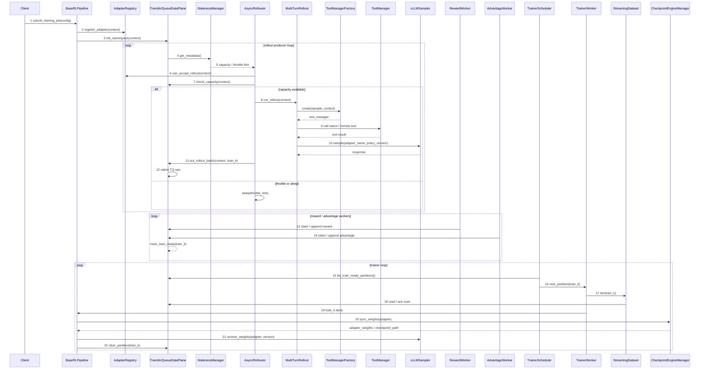

# 多租户 Multi-LoRA 异步 RL 设计

## 1. 背景与目标

客户端多租户异步 RL 的核心问题不是简单支持多个 LoRA adapter，而是要在同一套训练服务中同时隔离和路由：

```text
权重:
  base model 可以共享，LoRA adapter 必须隔离。

数据:
  TransferQueue 中的 partition、row、metadata、claim/ack/clear 必须隔离。

环境:
  不同租户或任务可能使用不同 env、tool、sandbox、browser、simulator。

Reward / loss:
  不同任务可能使用不同 reward_fn、advantage 规则和 loss 计算方式。

资源:
  rollout 并发、工具并发、TQ 容量、trainer slots 需要按租户和训练任务限额。
```

本设计面向“客户端提交多租户训练任务，服务端共享基础模型和异步 RL 基础设施”的场景。用户只需要声明训练身份、工具 profile、reward、loss 和配置；底层 pipeline 负责 TransferQueue 数据面、staleness 控制、权重同步和资源隔离。

第一版交互能力收敛到 `ToolManager` 级别：

```text
支持:
  native tool:
    平台内置、受信任的本地工具，例如 extract_condensed、受控 sandbox wrapper。

  remote tool:
    平台内置 RemoteTool wrapper 通过 HTTP/gRPC 调用用户自有工具服务。

暂不支持:
  server 直接 import 用户自定义 Env Python 代码。
  通用 EnvFactory / reset / step / close 协议作为热路径能力。
```

`Env` 和 `ToolManager` 不是互斥关系。长期设计中，Env 是真实环境交互层，ToolManager 是工具分发层；Env 可以持有 ToolManager。但第一版为了降低实现复杂度，只落地 `MultiTurnRollout + ToolManager`，把浏览器、游戏、复杂 simulator 这类强状态 Env 放到后续版本。

## 2. 核心概念

### 2.1 TrainingContext

`TrainingContext` 是一次训练任务在多租户系统中的路由和隔离身份。它不保存训练样本，只用于决定当前请求应该访问哪份数据、哪份 LoRA 权重、哪个环境、哪个 reward/loss 逻辑。

```python
@dataclass
class TrainingContext:
    tenant_id: str
    training_run_id: str
    base_model_id: str
    adapter_name: str
    adapter_revision: str | None
    policy_version: int

    env_type: str
    tool_profile: str
    reward_type: str
    loss_type: str
    algorithm: str
```

字段含义：

```text
tenant_id:
  租户、客户、业务方或项目空间。用于权限、quota、计费和租户级清理。

training_run_id:
  tenant 下的一次具体训练任务。用于 checkpoint、恢复、取消和 run 级生命周期。
  本方案约定一个 training_run 固定只训练一个 LoRA adapter。

base_model_id:
  共享基础模型标识。多个 tenant 可以共享同一个 base model。

adapter_name:
  当前训练任务使用的 LoRA adapter 名称。它与 training_run_id 一对一绑定。

adapter_revision:
  可选，用于区分已发布或已恢复的 adapter 版本。

policy_version:
  rollout 使用的策略版本。每次 train_k 完成训练并同步权重后递增。

env_type:
  环境类型。第一版只作为兼容和预留字段，默认可设为 tool_calling。

tool_profile:
  当前训练任务允许使用的工具集合配置，例如 code_agent、condense_agent。
  ToolManagerFactory 根据该字段创建 tenant/run/adapter 作用域内的 ToolManager。

reward_type:
  reward 实现类型，例如 unit_test_reward、format_reward、web_task_reward。

loss_type / algorithm:
  训练算法和 loss 选择，例如 grpo、ppo、dapo。
```

### 2.2 namespace

TransferQueue 中的数据必须按 `TrainingContext` 生成 namespace：

```text
{tenant_id}/{training_run_id}/{adapter_name}/train_{k}
```

示例：

```text
tenant_a/code_grpo_001/code_lora/train_7
tenant_b/browser_rl_003/browser_lora/train_2
```

文档中可以继续使用 `train_k` 描述逻辑生命周期，但底层写入、读取、claim、ack、clear 都必须带完整 namespace。

### 2.3 隔离边界

第一版不支持跨 context 混合训练：

```text
同一个 train_k:
  只能属于一个 tenant_id / training_run_id / adapter_name / policy_version。

同一个 GRPO group:
  只能来自同一个 prompt、同一个 adapter、同一个 policy_version。

同一个 optimizer batch:
  只能来自同一个 loss schema 和 reward schema。

同一个 ToolManager:
  不能跨 tenant / run 复用。ToolManager 内的 native/remote tool 必须按当前 context 做权限和 quota 校验。
```

## 3. 总体架构

正式架构图见 [multi_tenant_multi_lora_async_rl.drawio](multi_tenant_multi_lora_async_rl.drawio)。该图以 `TransferQueueDataPlane` 为中心，展示多租户、多 LoRA、rollout、reward/advantage、trainer、权重同步和 staleness 控制之间的组件关系。

```text
Client
  |
  | submit TrainingJobConfig
  v
BaseRLPipeline / Controller
  |
  | build TrainingContext
  | init TransferQueueDataPlane
  | create workers
  v
TransferQueueDataPlane  <-------------------------------+
  |                                                      |
  | namespace: tenant/run/adapter/train_k                |
  | metadata / rows / fields / claim / ack / clear       |
  |                                                      |
  +--> AsyncRollouter ----> ToolManagerFactory           |
  |        |                  |                          |
  |        |                  +--> native tool            |
  |        |                  +--> remote tool API        |
  |        +--> vLLMSampler(adapter_name, policy_version)
  |
  +--> RewardWorker ----> RewardRegistry[reward_type]
  |
  +--> AdvantageWorker -> algorithm-specific grouping
  |
  +--> TrainerWorker ---> StreamingDataset/DataLoader
  |        |
  |        +--> LossRegistry[loss_type]
  |
  +--> CheckpointEngineManager
           |
           +--> vLLMSampler.receive_weights(adapter_name, policy_version)
```

关键原则：

```text
TransferQueueDataPlane:
  是唯一 TQ 数据面入口，负责 namespace 拼接、metadata、claim/ack、append、clear 和容量保护。

StalenessManager:
  只按 context 计算 rollout capacity / throttle / sleep hint，不直接写 TQ，不做权重同步。

AsyncRollouter:
  根据 StalenessManager 返回的 capacity、配置最大并发、active_tasks 和 pending_queue 决定是否提交 rollout task。

ToolManagerFactory:
  根据 context.tool_profile 或 sample.tool_profile 创建租户隔离的 ToolManager。
  第一版只支持 native tool / remote tool，不支持 server import 用户 Env Python 代码。

RewardRegistry / LossRegistry:
  根据 context.reward_type / loss_type 路由到对应实现。
```

### 3.1 组件职责

| 组件 | 职责 | 不负责 |
|---|---|---|
| `Client` | 提交 `TrainingJobConfig`，声明 `tenant_id`、模型、LoRA、数据、tool、reward/loss、异步参数。 | 不直接访问 TQ，不直接操作服务端 adapter slot。 |
| `BaseRLPipeline / Controller` | 训练任务准入、构造 `TrainingContext`、初始化 TQ namespace、创建角色、接收 `train_k done` 事件、触发权重同步和 partition 清理。 | 不执行 rollout 细节，不计算 reward/advantage，不做 trainer 侧 batch 调度。 |
| `TransferQueueDataPlane` | TQ 的唯一数据面入口，负责 namespace 拼接、metadata 校验、容量检查、put/claim/append/ack/clear。 | 不决定 rollout 速度，不决定下一个训练哪个 LoRA。 |
| `TransferQueue Backend` | 存储 partition、rows、metadata 和字段列。 | 不理解业务语义，不做 staleness 或 adapter 状态决策。 |
| `AdapterRegistry` | 维护每个 `(tenant_id, training_run_id, adapter_name)` 的运行时状态，包括 `policy_version`、`live_partitions`、`in_flight_rollouts`、训练/同步状态。 | 不读写样本数据，不执行权重同步。 |
| `StalenessManager` | 基于 TQ metadata 和 adapter 状态计算 per-adapter rollout capacity、throttle/sleep hint。 | 不写 TQ，不清理 partition，不同步权重。 |
| `AsyncRollouter` | 维护 `pending_by_context` 和 `active_tasks`，在多个 LoRA 训练任务之间选择下一批 rollout；每次提交的 rollout batch 只属于一个 `TrainingContext`。 | 不在单次 submit batch 中混多个 LoRA，不计算 reward/advantage。 |
| `MultiTurnRollout` | 执行多轮 agent loop，组织 messages、调用 sampler、处理 tool 调用结果，产出 trajectory group。 | 不直接管理多租户容量和权重版本。 |
| `ToolManagerFactory / ToolManager` | 按 `tool_profile` 创建隔离的 tool manager；第一版支持 native tool 和 remote tool API。 | 第一版不支持 server 直接 import 用户 Env Python 代码。 |
| `vLLMSampler` | 使用 `adapter_name` 和 `policy_version` 发起多 LoRA rollout 生成；在权重同步后接收新 adapter 权重。 | 不决定训练哪个 partition。 |
| `RewardWorker` | 从 TQ claim rollout-ready 数据，按 `reward_type` 计算 reward 并写回字段。 | 不修改 rollout 原始内容，不清理 partition。 |
| `AdvantageWorker` | 从 TQ claim reward-ready 数据，按算法计算 advantage/return 并写回字段，最终推进到 `TRAIN_READY`。 | 不做 optimizer step。 |
| `TrainerScheduler` | 从 `TRAIN_READY` partition 中选择下一个 `train_k`，保证训练 partition 不混 adapter/loss/reward schema。 | 不执行 forward/backward，不写权重。 |
| `TrainerWorker` | 在 `train_k` 边界切换 LoRA，使用 StreamingDataLoader 读取 TQ 数据并执行训练。 | 不在一个 optimizer batch 中混不同 loss/reward schema。 |
| `StreamingDataset / StreamingDataLoader` | 将 TQ 中的 `train_k` 数据转换为 trainer 可迭代 batch，并完成读侧 ack。 | 不选择训练顺序。 |
| `CheckpointEngineManager` | 在 `train_k` 训练完成后导出 adapter 权重，供 rollout sampler 更新。 | 不管理 TQ partition 生命周期。 |

## 4. 数据面设计

### 4.1 sample metadata

每条写入 TQ 的 trajectory sample 至少包含：

```text
tenant_id
training_run_id
base_model_id
adapter_name
adapter_revision
policy_version
partition_id
group_id
generation_idx
env_type
tool_profile
reward_type
loss_type
algorithm
```

这些字段用于消费侧校验，不能只依赖 partition path。`TransferQueueDataPlane` 在写入和读取时都应校验 metadata 与当前 `TrainingContext` 一致。

### 4.2 partition metadata

`PartitionMetadata` 需要记录生命周期和恢复信息：

```python
@dataclass
class PartitionMetadata:
    context: TrainingContext
    partition_id: str
    policy_version: int
    target_groups: int
    ready_groups: int
    status: str
    created_at: float
    updated_at: float
    owner_worker_id: str | None
    lease_deadline: float | None
```

字段含义：

```text
context:
  当前 partition 所属的 TrainingContext。所有读写、claim、clear 都必须和它一致。

partition_id:
  逻辑 train_k，例如 train_7。物理 key 由 context + partition_id 拼接。

policy_version:
  生成该 train_k 样本时使用的 adapter 参数版本。

target_groups:
  该 train_k 计划收集的 prompt group 数量。

ready_groups:
  已经完成 rollout 并写入 TQ 的 prompt group 数量。

status:
  partition 生命周期状态，例如 OPEN、SEALED、ADVANTAGE_DONE、TRAIN_DONE。

created_at / updated_at:
  创建和最近更新时间，用于观测、超时检测和异常恢复。

owner_worker_id:
  当前 claim 或处理该 partition 的 worker 标识。没有 owner 时为 None。

lease_deadline:
  当前 owner 的租约过期时间。过期后可以进入 recovery 或重新 claim。
```

推荐状态：

```text
OPEN:
  rollout 还在追加样本。

SEALED:
  train_k rollout 完成，不再接收新样本。

REWARD_DONE:
  reward 已完成。

ADVANTAGE_DONE:
  advantage 已完成，可以训练。

TRAINING:
  trainer 正在消费。

TRAIN_DONE:
  trainer 完成 train_k。

CLEARED:
  权重同步完成，partition 已清理。

FAILED / CANCELLED:
  异常或用户取消。
```

### 4.3 TTL 与异常清理

TTL 不能作为正常清理机制。正常清理路径必须是：

```text
train_k rollout done
-> reward/advantage done
-> trainer consumed train_k
-> weight sync done
-> clear_partition(train_k)
```

TTL 只用于异常检测和终态回收：

```text
非终态 partition 超时:
  标记 expired / needs_recovery，不直接删除。

终态 partition 超时:
  CLEARED / CANCELLED / FAILED_CONFIRMED 可以 hard delete。
```

### 4.4 adapter record

`AdapterRegistry` 的一条 record 代表一个 `(tenant_id, training_run_id, adapter_name)` 的运行时状态。它不是样本，也不是 partition，而是一个 LoRA adapter 在当前训练任务中的生命周期记录。

```python
@dataclass
class AdapterRecord:
    tenant_id: str
    training_run_id: str
    adapter_name: str
    base_model_id: str
    state: str
    policy_version: int
    adapter_revision: str | None
    train_slot_name: str | None
    rollout_slot_name: str | None
    live_partitions: set[str]
    in_flight_rollouts: int
    training_partition: str | None
    sync_in_progress: bool
    created_at: float
    updated_at: float
    last_error: str | None
```

字段含义：

```text
tenant_id / training_run_id / adapter_name:
  adapter record 的唯一身份。

base_model_id:
  adapter 所属的共享基础模型。

state:
  adapter 生命周期状态，建议包含 REGISTERED / LOADING / ACTIVE / DRAINING / UNLOADING / DELETED / FAILED。

policy_version:
  当前可用于新 rollout request 的参数版本。只有权重同步成功后才递增。

adapter_revision:
  可选的 checkpoint 或发布版本标识。

train_slot_name:
  训练侧 MultiLoraTransformersModel 中的真实槽位名，例如 lora_0。业务逻辑通常仍使用 adapter_name。

rollout_slot_name:
  rollout/vLLM 侧的 adapter 标识。若 rollout 侧直接使用 adapter_name，可以为空。

live_partitions:
  已创建但尚未 clear 的 train_k 集合。它反映该 adapter 占用 TQ 的 partition 数。

in_flight_rollouts:
  已提交但尚未完成的 rollout task 数量。用于 draining、卸载保护和 adapter 级并发控制。

training_partition:
  当前 trainer 正在训练的 train_k。第一版同一 adapter 同时最多训练一个 partition。

sync_in_progress:
  是否正在执行权重导出和 rollout 权重同步。

created_at / updated_at:
  record 创建和最近更新时间。

last_error:
  最近一次加载、同步、卸载或训练失败信息。
```

## 5. LoRA 权重路由与切换

### 5.1 rollout 请求绑定 adapter

每个 rollout 请求必须显式绑定 `adapter_name` 和 `policy_version`：

```python
response = await sampler.sample(
    messages=messages,
    adapter_name=context.adapter_name,
    policy_version=context.policy_version,
)
```

一个 trajectory 在正常情况下只能使用一个 `(adapter_name, policy_version)`。

### 5.2 切换时机

允许切换 LoRA 的时机：

```text
新 rollout request 提交前:
  AsyncRollouter 为新 task 读取当前 context.policy_version。

train_k 训练完成并同步后:
  vLLMSampler.receive_weights(adapter_name, new_policy_version)。

partial rollout 被 abort 后恢复:
  已生成 token 可按配置 mask 掉，后续 token 使用新 policy_version。
```

不允许切换的时机：

```text
一个正在生成的 trajectory 中途。

一个未 abort 的多轮 agent trajectory 内。

一个 train_k 内混入多个 adapter。
```

### 5.3 权重同步

每个 `train_k` 训练完成后同步一次当前 adapter 权重：

```text
TrainerWorker train_k done
-> BaseRLPipeline.sync_weights(context, train_k)
-> CheckpointEngineManager.export_adapter(context.adapter_name)
-> vLLMSampler.receive_weights(context.adapter_name, new_policy_version)
-> TransferQueueDataPlane.clear_partition(context, train_k)
```

权重同步不由 `StalenessManager` 控制。`StalenessManager` 只控制 rollout 生产速度。

## 6. 工具与环境接入

```python
class ToolManagerFactory:
    def register_native_tool(self, profile: str, tool_name: str, tool_cls: type[Tool]) -> None:
        ...

    def register_remote_tool(self, profile: str, tool_name: str, remote_config: dict) -> None:
        ...

    def create(self, sample: dict, context: TrainingContext) -> ToolManager:
        tool_profile = sample.get("tool_profile") or context.tool_profile
        tool_config = sample.get("tool_config", {})
        tools = self._build_tools(tool_profile, tool_config, context)
        return ToolManager(tools)
```

第一版只要求支持 `ToolManager` 级别的交互：

```text
native tool:
  平台内置工具，运行在 server 受信任代码中。
  例如 extract_condensed、受控 sandbox wrapper、受控 retrieval wrapper。

remote tool:
  平台内置 RemoteTool wrapper 调用用户自有 HTTP/gRPC 工具服务。
  用户工具逻辑不进入 Twinkle server 进程。

ToolManager:
  每个 tenant/run/adapter 或每条 trajectory 创建独立实例。
  不允许跨 tenant 复用带状态的 ToolManager。
```

工具权限和资源要按 tenant/run/adapter 控制：

```text
tool whitelist
tool argument schema validation
remote endpoint allowlist
timeout
max concurrent tool calls
max remote tool QPS
max request / response bytes
audit log
```

### 6.1 native tool

native tool 是平台提供的受信任工具。用户只能通过配置选择工具 profile，不能上传任意 Python tool 代码让 server import。

```yaml
tool:
  profile: condense_agent
  allowed_tools:
    - extract_condensed
```

native tool 的典型用途：

```text
extract_condensed:
  上下文压缩恢复工具，不访问外部系统。

python_sandbox wrapper:
  由平台实现 sandbox 调用和资源限制，不直接执行用户上传 Python class。

retrieval wrapper:
  由平台实现访问控制和索引隔离。
```

### 6.2 remote tool

remote tool 用于接入用户自有工具服务。Twinkle server 只运行受信任的 `RemoteTool` wrapper：

```text
MultiTurnRollout
  -> ToolManager
      -> RemoteTool
          -> user-owned tool service
```

推荐协议：

```http
POST /tool/call
```

请求：

```json
{
  "tenant_id": "tenant_a",
  "training_run_id": "run_001",
  "adapter_name": "code_lora",
  "trajectory_id": "traj_123",
  "tool_call_id": "call_1",
  "tool_name": "search",
  "arguments": {
    "query": "..."
  }
}
```

响应：

```json
{
  "content": "tool result text",
  "metadata": {
    "latency_ms": 123
  }
}
```

配置示例：

```yaml
tool:
  profile: private_search_agent
  allowed_tools:
    - private_search
  remote_tools:
    private_search:
      endpoint: https://tools.tenant-a.example.com/tool/call
      auth_ref: tenant_a_tool_token
      timeout_ms: 5000
      allowed_domains:
        - tools.tenant-a.example.com
```

### 6.3 用户自定义环境的安全边界

多租户模式第一版不支持 server 直接 import 用户自定义 `Env` Python 代码。server 端只允许通过 `tool_profile / tool_config` 选择平台内置且经过审核的 native/remote tool wrapper。

后续如需通用 Env，只允许通过受控 `env_type / env_config` 选择平台内置 Env wrapper：

```yaml
env:
  type: remote
  config:
    endpoint: https://env.tenant-a.example.com
    timeout_ms: 5000
```

原因是用户自定义 Python class 如果直接运行在 rollout worker 进程里，本质上等价于给用户 server-side arbitrary code execution，可能读取服务端文件、访问内网、窃取 token、占满 CPU/内存，或者干扰 TransferQueue、checkpoint 和其他 tenant。

需要自定义逻辑时，只支持两种安全接入方式：

```text
Sandbox mode:
  用户代码或模型生成代码运行在隔离 sandbox 中。
  server 端 Env wrapper 负责创建 sandbox、限制资源、校验参数、收集 observation。

Remote env service mode:
  用户自己部署环境服务。
  server 端 Env wrapper 通过 HTTPS/gRPC 调用该服务，并控制 timeout、QPS、payload size、response schema 和审计日志。
```

因此，后续版本如果引入 `EnvFactory`，它的职责也不是加载任意用户代码，而是根据受控配置创建受信任的 server-side Env wrapper：

```text
Client:
  env_type / env_config / data

Server:
  EnvFactory -> trusted Env wrapper -> sandbox or remote env service
```

### 6.4 Env 与 ToolManager 的关系

长期设计中，Env 和 ToolManager 是同时存在的关系：

```text
Env:
  真实环境交互层，负责 reset/step/done、session、sandbox/browser/simulator 状态。

ToolManager:
  工具分发层，负责把上下文里的 tool_call 分发到 native/remote tool。
```

Env 可以持有 ToolManager：

```text
MultiTurnRollout
  -> Env.step(assistant_msg)
       -> ToolManager(tool_call)
       -> observation / done / info
```

第一版不落地通用 Env，只落地 `MultiTurnRollout -> ToolManager -> native/remote tool`。

## 7. Reward / Advantage / Loss 路由

### 7.1 RewardRegistry

RewardWorker 根据 `context.reward_type` 选择 reward 实现：

```python
reward_fn = reward_registry.get(context.reward_type)
reward = reward_fn(trajectory, context=context)
```

约束：

```text
reward 只能写回当前 context namespace。
reward schema 必须写入 metadata，trainer 侧校验一致。
不同 reward_type 的样本不能混入同一个 train_k。
```

### 7.2 Advantage

GRPO 默认按 prompt group 分组：

```text
group key = tenant_id / training_run_id / adapter_name / policy_version / group_id
```

第一版不支持 mixed-version group。只有同一个 `policy_version` 的 `num_generations` 条 trajectory 都 ready 后，才计算 advantage。

### 7.3 LossRegistry

TrainerWorker 根据 `context.loss_type` / `algorithm` 选择 loss：

```python
loss_fn = loss_registry.get(context.loss_type)
loss = loss_fn(batch, context=context)
```

Trainer batch 必须校验：

```text
tenant_id 一致
training_run_id 一致
adapter_name 一致
policy_version 一致
reward_type 一致
loss_type 一致
algorithm 一致
```

## 8. 容量、Quota 与 Staleness

### 8.1 容量初始化

单训练流容量：

```text
max_live_partitions_per_run = max_staleness + 1
samples_per_partition = target_prompt_groups_per_partition * rollout.num_generations
max_rows_per_run = samples_per_partition * max_live_partitions_per_run
```

多租户容量需要分层：

```text
global_max_rows / global_max_bytes:
  整个 TQ backend 的总容量。

tenant_max_rows / tenant_max_bytes:
  单租户最大占用。

run_max_rows / run_max_bytes:
  单 training_run 最大占用。

adapter_max_live_partitions:
  单 adapter 最多存活 train_k 数量，通常等于 max_staleness + 1。
```

### 8.2 multi-LoRA quota

多 LoRA 场景不能只限制 TQ rows/bytes，还必须限制 adapter slot、rollout 并发和 trainer 占用。第一版 quota 推荐按四层管理：

```text
global quota:
  整个服务的资源上限。

tenant quota:
  单租户资源上限，避免一个租户挤占所有容量。

training_run quota:
  单次训练任务资源上限，便于取消、恢复和计费。

adapter quota:
  单个 LoRA adapter 的 slot、partition、rollout、训练占用。
```

建议字段：

```python
@dataclass
class MultiLoraQuota:
    global_max_adapters: int
    global_max_tq_bytes: int
    global_max_in_flight_rollouts: int

    tenant_max_adapters: int
    tenant_max_tq_bytes: int
    tenant_max_in_flight_rollouts: int

    run_max_tq_bytes: int

    adapter_max_live_partitions: int
    adapter_max_in_flight_rollouts: int
    adapter_max_train_concurrency: int
```

字段含义：

```text
global_max_adapters:
  服务内同时 ACTIVE / LOADING / DRAINING 的 adapter 总数上限。

global_max_tq_bytes:
  TQ backend 全局容量保护阈值。

global_max_in_flight_rollouts:
  全局正在生成中的 rollout task 上限。

tenant_max_adapters:
  单租户可同时持有的 adapter 数量上限。

tenant_max_tq_bytes:
  单租户占用的 TQ bytes 上限。

tenant_max_in_flight_rollouts:
  单租户正在生成中的 rollout task 上限。

run_max_tq_bytes:
  单 training_run 占用的 TQ bytes 上限。

adapter_max_live_partitions:
  单 adapter 可同时存活的 train_k 数量，默认 max_staleness + 1。

adapter_max_in_flight_rollouts:
  单 adapter 正在生成中的 rollout task 上限。

adapter_max_train_concurrency:
  单 adapter 并行训练 partition 数。第一版固定为 1。
```

quota 检查点：

```text
新增 adapter:
  检查 global_max_adapters、tenant_max_adapters、该 training_run 是否已有 adapter、底层 MultiLora max_loras 空闲槽位。

提交 rollout task:
  检查 adapter state、adapter_max_in_flight_rollouts、tenant_max_in_flight_rollouts、global_max_in_flight_rollouts。

创建 / 追加 train_k:
  检查 adapter_max_live_partitions、run_max_tq_bytes、tenant_max_tq_bytes、global_max_tq_bytes。

调用 tool:
  第一版只检查 tool whitelist、remote endpoint allowlist 和 timeout。
  工具并发、QPS、request/response bytes 限制后续版本再加入。

训练 train_k:
  检查 adapter_max_train_concurrency，第一版同一 adapter 只能训练一个 train_k。
```

当 quota 超限时，默认动作是对 producer 侧施加背压：

```text
adapter quota 超限:
  暂停该 adapter 新 rollout。

tenant quota 超限:
  暂停该 tenant 新 rollout 和新 adapter 注册。

global quota 超限:
  全局 rollout throttle/sleep，只允许 reward/advantage/trainer 继续消费和清理。
```

### 8.3 StalenessManager 决策

`StalenessManager` 按 context 计算 capacity：

```python
capacity = staleness_manager.get_rollout_capacity(
    metadata=tq_data_plane.get_metadata(context),
    context=context,
)
```

决策规则：

```text
adapter live partitions > max_staleness + 1:
  暂停该 adapter rollout。

tenant quota 超限:
  暂停该 tenant 的新 rollout。

global quota 超限:
  所有 rollout throttle/sleep，只允许消费侧继续处理。

接近 throttle_watermark:
  AsyncRollouter 降低提交速率或减小 transfer batch。
```

`StalenessManager` 不删除数据。容量压力的优先动作是限制 producer，而不是丢弃未训练样本。

## 9. 客户端接入方式

### 9.1 用户代码

第一版用户通常只需要提供工具配置、reward 和 YAML 配置，不需要提交 server-side Env Python class：

```python
from twinkle_agentic.pipeline import AsyncAgenticRLPipeline
from twinkle_agentic.tools import ToolManagerFactory
from my_project.rewards import UnitTestReward


tool_factory = ToolManagerFactory()
tool_factory.register_remote_tool(
    profile="private_search_agent",
    tool_name="private_search",
    remote_config={
        "endpoint": "https://tools.tenant-a.example.com/tool/call",
        "auth_ref": "tenant_a_tool_token",
        "timeout_ms": 5000,
    },
)

pipeline = AsyncAgenticRLPipeline.from_yaml(
    "configs/tenant_a_code_async_rl.yaml",
    tool_manager_factory=tool_factory,
    reward_registry={
        "unit_test_reward": UnitTestReward(),
    },
)

pipeline.run()
```

如果用户要完全自定义 rollout 流程，可以继承 rollout：

```python
class CodeAgentRollout(MultiTurnRollout):
    async def run_group(self, sample, *, context, sampler, tool_manager_factory):
        tool_manager = tool_manager_factory.create(sample, context)
        ...
        return trajectories
```

后续版本如果引入通用 Env，用户也不应直接把 Env Python class 上传到 server；应通过 native Env wrapper 或 remote env service 接入。

如果用户要自定义整体编排流程，才继承 pipeline：

```python
class CustomRLPipeline(AsyncAgenticRLPipeline):
    def build_workers(self):
        ...

    async def on_train_partition_done(self, context, partition_id):
        ...
```

### 9.2 YAML 示例

```yaml
tenant:
  tenant_id: tenant_a
  training_run_id: code_agent_grpo_001

model:
  base_model_id: Qwen/Qwen3.5-4B

adapter:
  multi_lora: true
  adapter_name: tenant_a_code_lora
  adapter_revision: null

rollout:
  type: multi_turn
  num_generations: 8
  max_turns: 6
  max_concurrent_groups: 64
  transfer_batch_groups: 4

tool:
  profile: private_search_agent
  allowed_tools:
    - private_search
  remote_tools:
    private_search:
      endpoint: https://tools.tenant-a.example.com/tool/call
      auth_ref: tenant_a_tool_token
      timeout_ms: 5000

reward:
  type: unit_test_reward

trainer:
  algorithm: grpo
  loss_type: grpo
  global_batch_size: 128
  mini_batch_size: 32

async_rl:
  max_staleness: 2
  partial_rollout: false

transfer_queue:
  namespace: "{tenant_id}/{training_run_id}/{adapter_name}"
  storage_backend: SimpleStorage
  capacity:
    global_max_bytes: 200GiB
    tenant_max_bytes: 40GiB
    run_max_bytes: 20GiB
    safety_factor: 1.2

quota:
  global_max_adapters: 32
  tenant_max_adapters: 4
  adapter_max_live_partitions: 3
  adapter_max_in_flight_rollouts: 64
  tenant_max_in_flight_rollouts: 128
```

## 10. 正常流程

本节编号与 [multi_tenant_multi_lora_async_rl.drawio](multi_tenant_multi_lora_async_rl.drawio) 中的连线编号一致。

| 序号 | 调用 | 说明 |
|---:|---|---|
| 1 | `submit_training_job(config)` | `Client` 提交训练任务配置。配置里包含租户、基础模型、LoRA adapter、数据源、tool profile、reward/loss、异步训练参数等。 |
| 2 | `register_adapter(context)` | `BaseRLPipeline` 构造 `TrainingContext` 后，把当前训练任务的 LoRA 注册到 `AdapterRegistry`。一个 `training_run_id` 固定对应一个 `adapter_name`。 |
| 3 | `init_namespace(context)` | `BaseRLPipeline` 让 `TransferQueueDataPlane` 初始化 TQ namespace，例如 `{tenant_id}/{training_run_id}/{adapter_name}/train_k`，并写入基础 metadata 约束。 |
| 4 | `get_metadata()` | `TransferQueueDataPlane` 向 `StalenessManager` 提供当前 live partitions、oldest partition、partition 状态和 policy_version 等容量事实。 |
| 5 | `capacity / throttle hint` | `StalenessManager` 按当前 adapter 的 `max_staleness` 计算还能继续提交多少 rollout，以及是否需要 throttle 或 sleep。 |
| 6 | `can_accept_rollout(context)` | `AsyncRollouter` 询问 `AdapterRegistry` 当前 adapter 是否处于可 rollout 状态，并检查 `in_flight_rollouts`、`live_partitions`、同步状态等运行时状态。 |
| 7 | `check_capacity(context)` | `AsyncRollouter` 在提交前向 `TransferQueueDataPlane` 检查目标 namespace 的 TQ 容量是否还能接收新的 rollout rows。 |
| 8 | `run_rollout(context)` | `AsyncRollouter` 选择一个 `TrainingContext` 后启动 rollout task。一次 submit batch 内只包含同一个 tenant/run/adapter/policy_version。 |
| 9 | `call native / remote tool` | `MultiTurnRollout` 在多轮交互中通过 `ToolManager` 调用 native tool 或 remote tool API。第一版不 import 用户 Env Python 代码。 |
| 10 | `sample(adapter_name, policy_version)` | `MultiTurnRollout` 调用 `vLLMSampler` 生成模型回复。请求必须携带 `adapter_name` 和 `policy_version`，用于多 LoRA 路由和版本追踪。 |
| 11 | `put_rollout_batch(context, train_k)` | rollout 完成一批 trajectory group 后，由 `AsyncRollouter` 写入对应 `train_k` partition。写入时附带 sample metadata。 |
| 12 | `native TQ ops` | `TransferQueueDataPlane` 将 put/claim/append/clear 等操作转换为底层 TransferQueue backend 操作。 |
| 13 | `claim / append reward` | `RewardWorker` claim rollout-ready 数据，按 `reward_type` 计算 reward，并追加 reward 字段。 |
| 14 | `claim / append advantage` | `AdvantageWorker` claim reward-ready 数据，按算法计算 advantage/return，并追加字段。满足训练条件后将 partition 标记为 `TRAIN_READY`。 |
| 15 | `list_train_ready_partitions()` | `TrainerScheduler` 从 `TransferQueueDataPlane` 查询可训练 partition 候选集合。候选必须已经完成 rollout、reward、advantage。 |
| 16 | `next_partition(train_k)` | `TrainerScheduler` 选择下一个训练 partition。选择结果必须保持 `train_k` 内 adapter、policy_version、loss/reward schema 一致。 |
| 17 | `iter(train_k)` | `TrainerWorker` 针对选中的 `train_k` 构建 `StreamingDataset / StreamingDataLoader`，开始按 batch 读取训练数据。 |
| 18 | `read / ack rows` | `StreamingDataset / StreamingDataLoader` 通过 `TransferQueueDataPlane` 从 TQ 读取 rows，并对已消费数据做 ack/progress 更新。 |
| 19 | `train_k done` | `TrainerWorker` 完成当前 partition 的全部 optimizer steps 后，通知 `BaseRLPipeline` 当前 `train_k` 已训练完成。 |
| 20 | `sync_weights(adapter)` | `BaseRLPipeline` 触发 `CheckpointEngineManager` 导出当前 adapter 的新权重。权重同步粒度是一个 `train_k`，不是每个 optimizer step。 |
| 21 | `receive_weights(adapter, version)` | `vLLMSampler` 接收新 adapter 权重，并更新 rollout 侧可用的 `policy_version`。 |
| 22 | `clear_partition(train_k)` | 权重同步完成后，`BaseRLPipeline` 通过 `TransferQueueDataPlane` 清理已训练完成的 `train_k`，释放 TQ 容量并推进 staleness 窗口。 |

关键约束：

```text
rollout submit batch:
  只能包含一个 TrainingContext。

train_k:
  只能包含一个 adapter_name / policy_version / reward_type / loss_type / algorithm。

权重同步:
  训练完一个 train_k 后同步一次 adapter 权重。

partition 清理:
  必须在训练完成并且 rollout 侧权重同步成功后执行。
```

### 10.1 时序图



这个时序图里有两个关键决策点：

```text
Rollout 侧:
  AdapterRegistry 判断 adapter 是否 ACTIVE；
  StalenessManager 判断当前 context 是否还有 rollout capacity；
  AsyncRollouter 才决定 submit / throttle / sleep。

Trainer 侧:
  TransferQueueDataPlane 提供 TRAIN_READY partitions；
  AdapterRegistry 过滤当前可训练 adapter；
  TrainerScheduler 选择下一个 train_k；
  TrainerWorker 根据 train_k.context.adapter_name 在 partition 边界切换 LoRA。
```

## 11. 异常与恢复

```text
worker 崩溃:
  通过 lease_deadline 发现，未完成 claim 重新进入可 claim 状态或标记 failed。

tenant 取消训练:
  clear_namespace(tenant_id/training_run_id)，停止 rollout/tool/reward/train worker。

tool 超时:
  当前 trajectory 标记 stop_reason=tool_timeout 或 tool_error，是否参与训练由 reward/loss 决定。

quota 超限:
  暂停对应 tenant/run/adapter 的 rollout producer，不删除未训练数据。

partition 过期:
  非终态只进入 recovery，不直接 hard delete。

权重同步失败:
  train_k 保持 TRAIN_DONE 或 SYNC_FAILED，禁止 clear_partition，等待 retry。
```

## 12. 第一版约束

第一版建议明确不支持：

```text
1. 一个 train_k 混多个 adapter。
2. 一个 GRPO group 混多个 policy_version。
3. 一个 optimizer batch 混多个 loss_type / reward_type。
4. ToolManager 或带状态 native/remote tool 跨 tenant 复用。
5. TTL 自动删除非终态训练数据。
6. TQ backend offload 替代 staleness/backpressure。
7. server 直接 import 并执行用户自定义 Env Python 代码。
8. 第一版实现通用 EnvFactory / reset / step / close 协议。
```

后续如果要支持 mixed-version batch，需要额外设计 per-sample importance correction、版本级 loss mask、trainer batch grouping 和权重版本追踪，不建议放入第一版。
