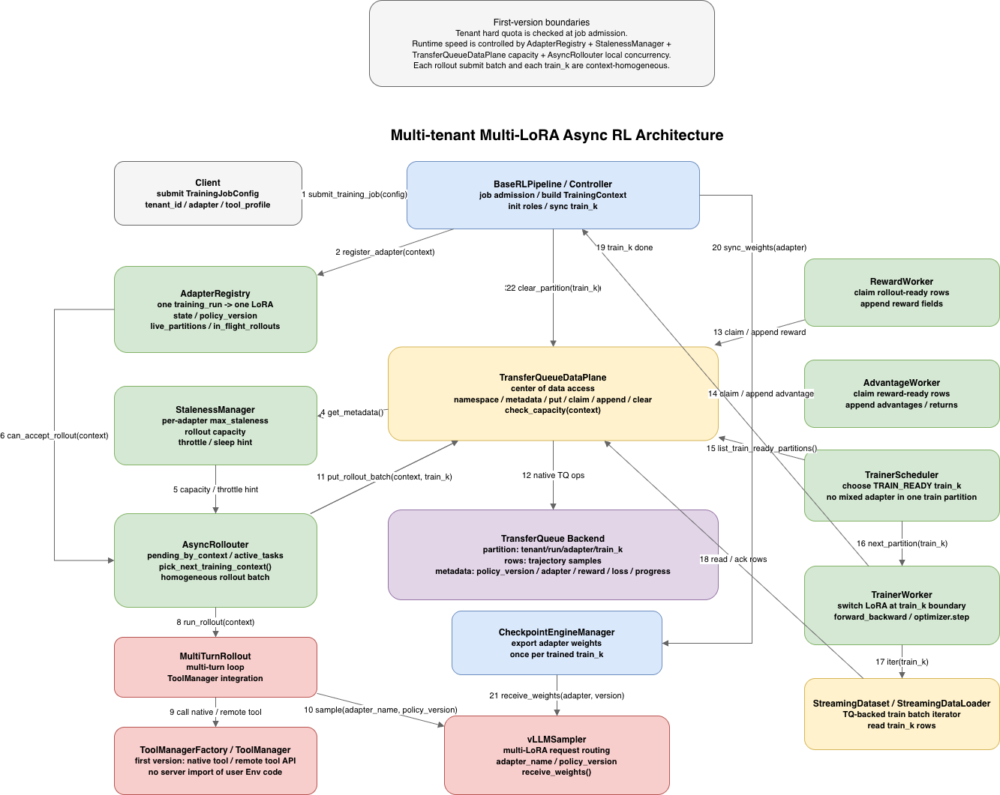
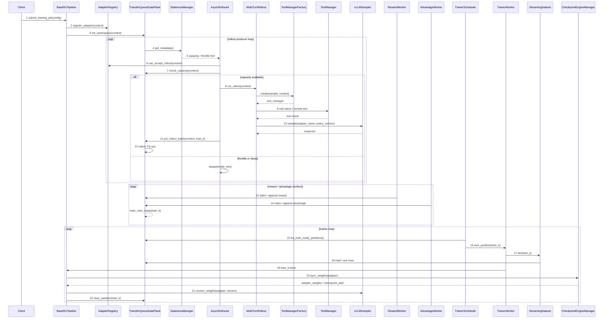

# 多租户 Multi-LoRA 异步 RL 设计

## 1. 背景与目标

客户端多租户异步 RL 的核心问题不是简单支持多个 LoRA adapter，而是要在同一套训练服务中同时隔离和路由：

```text
权重:
  base model 可以共享，LoRA adapter 必须隔离。

数据:
  TransferQueue 中的 partition、row、metadata、claim/ack/clear 必须隔离。

环境:
  不同租户或任务可能使用不同 env、tool、sandbox、browser、simulator。

Reward / loss:
  不同任务可能使用不同 reward_fn、advantage 规则和 loss 计算方式。

资源:
  rollout 并发、工具并发、TQ 容量、trainer slots 需要按租户和训练任务限额。
```

本设计面向“客户端提交多租户训练任务，服务端共享基础模型和异步 RL 基础设施”的场景。用户只需要声明训练身份、工具 profile、reward、loss 和配置；底层 pipeline 负责 TransferQueue 数据面、staleness 控制、权重同步和资源隔离。

第一版交互能力收敛到 `ToolManager` 级别：

```text
支持:
  native tool:
    平台内置、受信任的本地工具，例如 extract_condensed、受控 sandbox wrapper。

  remote tool:
    平台内置 RemoteTool wrapper 通过 HTTP/gRPC 调用用户自有工具服务。

暂不支持:
  server 直接 import 用户自定义 Env Python 代码。
  通用 EnvFactory / reset / step / close 协议作为热路径能力。
```

`Env` 和 `ToolManager` 不是互斥关系。长期设计中，Env 是真实环境交互层，ToolManager 是工具分发层；Env 可以持有 ToolManager。但第一版为了降低实现复杂度，只落地 `MultiTurnRollout + ToolManager`，把浏览器、游戏、复杂 simulator 这类强状态 Env 放到后续版本。

## 2. 核心概念

### 2.1 TrainingContext

`TrainingContext` 是一次训练任务在多租户系统中的路由和隔离身份。它不保存训练样本，只用于决定当前请求应该访问哪份数据、哪份 LoRA 权重、哪个环境、哪个 reward/loss 逻辑。

```python
@dataclass
class TrainingContext:
    tenant_id: str
    training_run_id: str
    base_model_id: str
    adapter_name: str
    adapter_revision: str | None
    policy_version: int

    env_type: str
    tool_profile: str
    reward_type: str
    loss_type: str
    algorithm: str
```

字段含义：

```text
tenant_id:
  租户、客户、业务方或项目空间。用于权限、quota、计费和租户级清理。

training_run_id:
  tenant 下的一次具体训练任务。用于 checkpoint、恢复、取消和 run 级生命周期。
  本方案约定一个 training_run 固定只训练一个 LoRA adapter。

base_model_id:
  共享基础模型标识。多个 tenant 可以共享同一个 base model。

adapter_name:
  当前训练任务使用的 LoRA adapter 名称。它与 training_run_id 一对一绑定。

adapter_revision:
  可选，用于区分已发布或已恢复的 adapter 版本。

policy_version:
  rollout 使用的策略版本。每次 train_k 完成训练并同步权重后递增。

env_type:
  环境类型。第一版只作为兼容和预留字段，默认可设为 tool_calling。

tool_profile:
  当前训练任务允许使用的工具集合配置，例如 code_agent、condense_agent。
  ToolManagerFactory 根据该字段创建 tenant/run/adapter 作用域内的 ToolManager。

reward_type:
  reward 实现类型，例如 unit_test_reward、format_reward、web_task_reward。

loss_type / algorithm:
  训练算法和 loss 选择，例如 grpo、ppo、dapo。
```

### 2.2 namespace

TransferQueue 中的数据必须按 `TrainingContext` 生成 namespace：

```text
{tenant_id}/{training_run_id}/{adapter_name}/train_{k}
```

示例：

```text
tenant_a/code_grpo_001/code_lora/train_7
tenant_b/browser_rl_003/browser_lora/train_2
```

文档中可以继续使用 `train_k` 描述逻辑生命周期，但底层写入、读取、claim、ack、clear 都必须带完整 namespace。

### 2.3 隔离边界

第一版不支持跨 context 混合训练：

```text
同一个 train_k:
  只能属于一个 tenant_id / training_run_id / adapter_name / policy_version。

同一个 GRPO group:
  只能来自同一个 prompt、同一个 adapter、同一个 policy_version。

同一个 optimizer batch:
  只能来自同一个 loss schema 和 reward schema。

同一个 ToolManager:
  不能跨 tenant / run 复用。ToolManager 内的 native/remote tool 必须按当前 context 做权限和 quota 校验。
```

## 3. 总体架构



| 序号 | 调用 | 说明 |
|---:|---|---|
| 1 | `submit_training_job(config)` | `Client` 提交训练任务配置。配置里包含租户、基础模型、LoRA adapter、数据源、tool profile、reward/loss、异步训练参数等。 |
| 2 | `register_adapter(context)` | `BaseRLPipeline` 构造 `TrainingContext` 后，把当前训练任务的 LoRA 注册到 `AdapterRegistry`。一个 `training_run_id` 固定对应一个 `adapter_name`。 |
| 3 | `init_namespace(context)` | `BaseRLPipeline` 让 `TransferQueueDataPlane` 初始化 TQ namespace，例如 `{tenant_id}/{training_run_id}/{adapter_name}/train_k`，并写入基础 metadata 约束。 |
| 4 | `get_metadata()` | `TransferQueueDataPlane` 向 `StalenessManager` 提供当前 live partitions、oldest partition、partition 状态和 policy_version 等容量事实。 |
| 5 | `capacity / throttle hint` | `StalenessManager` 按当前 adapter 的 `max_staleness` 计算还能继续提交多少 rollout，以及是否需要 throttle 或 sleep。 |
| 6 | `can_accept_rollout(context)` | `AsyncRollouter` 询问 `AdapterRegistry` 当前 adapter 是否处于可 rollout 状态，并检查 `in_flight_rollouts`、`live_partitions`、同步状态等运行时状态。 |
| 7 | `check_capacity(context)` | `AsyncRollouter` 在提交前向 `TransferQueueDataPlane` 检查目标 namespace 的 TQ 容量是否还能接收新的 rollout rows。 |
| 8 | `run_rollout(context)` | `AsyncRollouter` 选择一个 `TrainingContext` 后启动 rollout task。一次 submit batch 内只包含同一个 tenant/run/adapter/policy_version。 |
| 9 | `call native / remote tool` | `MultiTurnRollout` 在多轮交互中通过 `ToolManager` 调用 native tool 或 remote tool API。第一版不 import 用户 Env Python 代码。 |
| 10 | `sample(adapter_name, policy_version)` | `MultiTurnRollout` 调用 `vLLMSampler` 生成模型回复。请求必须携带 `adapter_name` 和 `policy_version`，用于多 LoRA 路由和版本追踪。 |
| 11 | `put_rollout_batch(context, train_k)` | rollout 完成一批 trajectory group 后，由 `AsyncRollouter` 写入对应 `train_k` partition。写入时附带 sample metadata。 |
| 12 | `native TQ ops` | `TransferQueueDataPlane` 将 put/claim/append/clear 等操作转换为底层 TransferQueue backend 操作。 |
| 13 | `claim / append reward` | `RewardWorker` claim rollout-ready 数据，按 `reward_type` 计算 reward，并追加 reward 字段。 |
| 14 | `claim / append advantage` | `AdvantageWorker` claim reward-ready 数据，按算法计算 advantage/return，并追加字段。满足训练条件后将 partition 标记为 `TRAIN_READY`。 |
| 15 | `list_train_ready_partitions()` | `TrainerScheduler` 从 `TransferQueueDataPlane` 查询可训练 partition 候选集合。候选必须已经完成 rollout、reward、advantage。 |
| 16 | `next_partition(train_k)` | `TrainerScheduler` 选择下一个训练 partition。选择结果必须保持 `train_k` 内 adapter、policy_version、loss/reward schema 一致。 |
| 17 | `iter(train_k)` | `TrainerWorker` 针对选中的 `train_k` 构建 `StreamingDataset / StreamingDataLoader`，开始按 batch 读取训练数据。 |
| 18 | `read / ack rows` | `StreamingDataset / StreamingDataLoader` 通过 `TransferQueueDataPlane` 从 TQ 读取 rows，并对已消费数据做 ack/progress 更新。 |
| 19 | `train_k done` | `TrainerWorker` 完成当前 partition 的全部 optimizer steps 后，通知 `BaseRLPipeline` 当前 `train_k` 已训练完成。 |
| 20 | `sync_weights(adapter)` | `BaseRLPipeline` 触发 `CheckpointEngineManager` 导出当前 adapter 的新权重。权重同步粒度是一个 `train_k`，不是每个 optimizer step。 |
| 21 | `receive_weights(adapter, version)` | `vLLMSampler` 接收新 adapter 权重，并更新 rollout 侧可用的 `policy_version`。 |
| 22 | `clear_partition(train_k)` | 权重同步完成后，`BaseRLPipeline` 通过 `TransferQueueDataPlane` 清理已训练完成的 `train_k`，释放 TQ 容量并推进 staleness 窗口。 |

关键约束：

```text
rollout submit batch:
  只能包含一个 TrainingContext。

train_k:
  只能包含一个 adapter_name / policy_version / reward_type / loss_type / algorithm。

权重同步:
  训练完一个 train_k 后同步一次 adapter 权重。

partition 清理:
  必须在训练完成并且 rollout 侧权重同步成功后执行。
```

### 3.1 时序图



这个时序图里有两个关键决策点：

```text
Rollout 侧:
  AdapterRegistry 判断 adapter 是否 ACTIVE；
  StalenessManager 判断当前 context 是否还有 rollout capacity；
  AsyncRollouter 才决定 submit / throttle / sleep。

Trainer 侧:
  TransferQueueDataPlane 提供 TRAIN_READY partitions；
  AdapterRegistry 过滤当前可训练 adapter；
  TrainerScheduler 选择下一个 train_k；
  TrainerWorker 根据 train_k.context.adapter_name 在 partition 边界切换 LoRA。
```

## 4. 多 LoRA 调度策略

多租户多 LoRA 的调度目标不是固定的。不同场景下可能需要不同策略：

```text
吞吐优先:
  尽量减少 rollout / reward / advantage / trainer / weight sync 的空泡。

公平优先:
  让不同 tenant / training_run / LoRA 按权重获得 rollout 和 train 机会。
```

因此调度逻辑应拆成两层：

```text
gating:
  判断某个 TrainingContext 是否有资格参与调度。

policy:
  在所有有资格的候选中选择下一个 TrainingContext 或 train_k。
```

所有策略都必须先经过 gating。公平策略不能绕过 staleness，吞吐策略也不能绕过租户隔离。

### 4.1 Rollout 调度

`AsyncRollouter` 负责多 LoRA rollout 侧调度。它内部维护 pending 和 active 状态，不需要单独引入 `RolloutScheduler` 组件。

推荐状态：

```python
@dataclass
class RolloutContextState:
    context: TrainingContext
    pending_groups: int
    in_flight_rollouts: int
    live_partitions: int
    open_partitions: int
    train_ready_partitions: int
    rollout_capacity: int
    last_submit_time: float
    submitted_groups: int
    weight: float = 1.0
```

`AsyncRollouter.pick_next_training_context()` 的 gating 顺序：

```text
1. 当前 context 有 pending prompt group。
2. AdapterRegistry 判断 adapter 处于 ACTIVE。
3. adapter 不在 sync_in_progress / draining / cancelled 状态。
4. StalenessManager 判断当前 context 仍有 rollout capacity。
5. TransferQueueDataPlane.check_capacity(context) 通过。
6. 当前 context 的 in_flight_rollouts 未超过配置上限。
7. AsyncRollouter 全局 active_tasks 未超过 max_concurrent_groups。
```

通过 gating 后再进入策略选择。

#### 4.1.1 吞吐优先策略

吞吐优先策略是 work-conserving 的：只要系统还有容量，就尽量提交 rollout task。

推荐优先级：

```text
1. 优先选择没有 OPEN partition 的 context。
2. 再选择 live_partitions 最少的 context。
3. 再选择 in_flight_rollouts 最少的 context。
4. 同分时 round-robin。
```

这样可以让 trainer 未来更容易拿到 `TRAIN_READY` 数据，减少训练侧空等。

伪代码：

```python
def pick_work_conserving(candidates: list[RolloutContextState]):
    candidates = [c for c in candidates if c.rollout_capacity > 0]
    if not candidates:
        return None

    return min(
        candidates,
        key=lambda c: (
            c.open_partitions > 0,
            c.live_partitions,
            c.in_flight_rollouts,
            c.last_submit_time,
        ),
    ).context
```

#### 4.1.2 公平策略

公平策略用于平台多租户场景。目标是让不同 tenant / adapter 长期获得接近权重比例的 rollout 机会。

推荐使用 deficit round-robin，而不是简单 round-robin。原因是不同任务的 rollout 时长可能差异很大，简单轮转容易被长尾任务拖慢。

```python
class DeficitFairRolloutPolicy:
    def __init__(self, quantum: int):
        self.quantum = quantum
        self.deficit: dict[str, float] = defaultdict(float)

    def pick_next_context(self, candidates: list[RolloutContextState]):
        for state in self.round_robin(candidates):
            key = state.context_key
            self.deficit[key] += state.weight * self.quantum

            cost = 1  # 第一版按一个 prompt group 计费
            if self.deficit[key] >= cost:
                self.deficit[key] -= cost
                return state.context

        return None
```

第一版可以先把 `cost` 固定为 `1 prompt group`。后续如果要更精细，可以改为 token 数、预计 rollout 时长或实际资源消耗。

### 4.2 Trainer 调度

`TrainerScheduler` 负责训练侧调度。它只从 `TRAIN_READY` partition 中选择下一个 `train_k`，不负责 rollout 生产。

gating 顺序：

```text
1. partition.status == TRAIN_READY。
2. partition 内 metadata 同属一个 TrainingContext。
3. AdapterRegistry.can_train(context) 通过。
4. adapter 不在 sync_in_progress / cancelled 状态。
5. train_k 的 reward_type / loss_type / algorithm 与 trainer 可执行配置匹配。
```

通过 gating 后再进入策略选择。

#### 4.2.1 吞吐优先策略

吞吐优先策略要同时减少 trainer 空泡和 LoRA 切换成本：

```text
1. 如果当前 adapter 有 TRAIN_READY partition，继续训练当前 adapter。
2. 如果当前 adapter 没有 TRAIN_READY partition，立即切到其他 ready adapter。
3. 多个 adapter 都 ready 时，选择 ready_partition_count 最多的 adapter。
4. 同分时选择 oldest train_k。
```

伪代码：

```python
def pick_prefer_current(candidates, current_context):
    same = ready_for_context(candidates, current_context)
    if same:
        return oldest_partition(same)

    grouped = group_by_context(candidates)
    return max(
        grouped.items(),
        key=lambda item: (len(item[1]), -oldest_partition_id(item[1])),
    )[1][0]
```

该策略不会为了等待当前 LoRA 而让 trainer 空转。

#### 4.2.2 公平策略

公平训练策略用于要求不同 tenant / LoRA 按权重获得训练机会的场景。

第一版可以按 `train_k` 粒度做 deficit fair scheduling：

```python
class DeficitFairTrainPolicy:
    def __init__(self, quantum: int):
        self.quantum = quantum
        self.deficit: dict[str, float] = defaultdict(float)

    def pick_next_partition(self, candidates, current_context):
        grouped = group_by_context(candidates)

        for context, partitions in self.round_robin(grouped):
            key = context.key
            self.deficit[key] += context.weight * self.quantum

            cost = 1  # 第一版按一个 train_k 计费
            if self.deficit[key] >= cost:
                self.deficit[key] -= cost
                return oldest_partition(partitions)

        return None
```

后续可以把 `cost` 改为 `num_rows`、token 数或 optimizer step 数。

### 4.3 策略配置

推荐在配置里显式声明 rollout 和 trainer 两侧策略：

```yaml
multi_lora:
  rollout_schedule:
    policy: work_conserving   # work_conserving | fair
    fairness_unit: group
    weights:
      tenant_a/code_lora: 1.0
      tenant_b/math_lora: 1.0

  train_schedule:
    policy: prefer_current    # prefer_current | fair | fifo
    fairness_unit: partition
    switch_penalty: 0.0
    weights:
      tenant_a/code_lora: 1.0
      tenant_b/math_lora: 1.0
```

配置建议：

```text
追求吞吐、减少空泡:
  rollout_schedule.policy = work_conserving
  train_schedule.policy = prefer_current

追求租户公平:
  rollout_schedule.policy = fair
  train_schedule.policy = fair

高优租户:
  使用 fair 策略并提高该租户或 adapter 的 weight。
```

### 4.4 减少空泡的边界

减少空泡不能破坏数据一致性：

```text
允许:
  不同 submit batch 使用不同 LoRA。
  vLLMSampler 内部并发处理多个 LoRA 请求。
  adapter_a 权重同步时，adapter_b 继续 rollout 或 train。

不允许:
  一个 submit batch 混多个 LoRA。
  一个 train_k 混多个 LoRA。
  trainer 在 train_k 中途切换 adapter。
  sync_in_progress 的 adapter 继续提交新 rollout 或新 train_k。
```

`sync_in_progress` 是 per-adapter 状态，不是 global 状态。某个 adapter 同步权重时，只暂停该 adapter 的新 rollout / train，不阻塞其他 adapter。

## 5. Worker 租户隔离原则

多租户模式下，worker 可以共享进程池，但每次执行必须以 `TrainingContext` 为隔离边界。隔离不是必须“一租户一个 worker”，而是必须保证 claim、compute、append、ack 都不能跨 namespace。

### 5.1 通用隔离要求

所有处理 TQ 数据的 worker 都必须满足：

```text
claim:
  只能从当前 context 对应 namespace claim 数据。

compute:
  只能使用当前 context 指定的 reward_type / loss_type / tool_profile / algorithm。

append:
  写回字段时必须校验 sample metadata 和 context 一致。

state:
  不能跨 tenant / training_run 复用有状态 client、缓存、sandbox、token 或 ToolManager。

permission:
  访问 remote tool、remote reward、secret、文件、数据库时，只能使用当前 tenant 授权。
```

写回前至少校验：

```text
sample.tenant_id == context.tenant_id
sample.training_run_id == context.training_run_id
sample.adapter_name == context.adapter_name
sample.policy_version == context.policy_version
sample.reward_type == context.reward_type
sample.loss_type == context.loss_type
```

### 5.2 RewardWorker 隔离

`RewardWorker` 必须做租户隔离。第一版推荐共享 worker pool，但每个 batch 必须是 context-homogeneous：

```text
同一个 reward batch 内只能有一个:
  tenant_id
  training_run_id
  adapter_name
  reward_type
  policy_version
  train_k
```

推荐流程：

```python
class RewardWorker:
    async def run_once(self):
        batch = await tq.claim_reward_batch()
        context = batch.context

        reward_fn = reward_registry.get(context.reward_type)
        reward_client = reward_client_factory.create(context)

        rewards = await reward_fn.compute(batch.samples, context, reward_client)

        await tq.append_rewards(context, batch.partition_id, rewards)
```

关键要求：

```text
1. 不允许跨 namespace claim rollout-ready 数据。
2. 不允许一个 reward_fn 处理其他 tenant 的数据。
3. 不允许跨 tenant 复用有状态 reward client。
4. 不允许 server import 用户自定义 reward Python 代码。
5. append_rewards 时必须校验 context metadata。
```

如果 reward 逻辑不可信、需要代码执行、浏览器、远程 verifier 或强资源隔离，应将 reward 逻辑放到 sandbox 或 user-owned remote reward service 中。

### 5.3 AdvantageWorker 隔离

`AdvantageWorker` 的隔离要求与 `RewardWorker` 类似。它只能处理同一个 `TrainingContext` 下 reward-ready 的 rows，并且 advantage 计算不能跨 adapter 或 policy_version 聚合。

```text
GRPO group:
  必须在同一个 tenant/run/adapter/policy_version 内计算。

advantage / return:
  只能写回原 namespace 下的 train_k。
```

### 5.4 TrainerWorker 隔离

`TrainerWorker` 的隔离边界是 `train_k`：

```text
1. 一个 train_k 只能属于一个 adapter。
2. 一个 optimizer batch 只能来自一个 loss_type / reward_type / algorithm。
3. LoRA 只能在 train_k 边界切换。
4. train_k 完成后才允许触发该 adapter 的权重同步。
```

`TrainerScheduler` 可以在多个 adapter 的 `TRAIN_READY` partition 之间选择，但不能把多个 adapter 混进一个训练 partition。

### 5.5 ToolManager 隔离

`ToolManager` 必须按 `tenant_id / training_run_id / adapter_name / tool_profile` 创建或绑定：

```text
native tool:
  只能使用平台内置、受信任工具。

remote tool:
  只能调用当前 tenant 配置中允许的 endpoint 和 auth_ref。

stateful tool:
  不能跨 tenant 或 training_run 复用状态。
```

第一版不支持 server 直接 import 用户 Env Python 代码。需要自定义逻辑时，用户逻辑必须运行在 sandbox 或 user-owned remote tool / env service 中。

## 6. 异常与恢复

```text
worker 崩溃:
  通过 lease_deadline 发现，未完成 claim 重新进入可 claim 状态或标记 failed。

tenant 取消训练:
  clear_namespace(tenant_id/training_run_id)，停止 rollout/tool/reward/train worker。

tool 超时:
  当前 trajectory 标记 stop_reason=tool_timeout 或 tool_error，是否参与训练由 reward/loss 决定。

quota 超限:
  暂停对应 tenant/run/adapter 的 rollout producer，不删除未训练数据。

partition 过期:
  非终态只进入 recovery，不直接 hard delete。

权重同步失败:
  train_k 保持 TRAIN_DONE 或 SYNC_FAILED，禁止 clear_partition，等待 retry。
```

## 7. 第一版约束

第一版建议明确不支持：

```text
1. 一个 train_k 混多个 adapter。
2. 一个 GRPO group 混多个 policy_version。
3. 一个 optimizer batch 混多个 loss_type / reward_type。
4. ToolManager 或带状态 native/remote tool 跨 tenant 复用。
5. TTL 自动删除非终态训练数据。
6. TQ backend offload 替代 staleness/backpressure。
7. server 直接 import 并执行用户自定义 Env Python 代码。
8. 第一版实现通用 EnvFactory / reset / step / close 协议。
```

后续如果要支持 mixed-version batch，需要额外设计 per-sample importance correction、版本级 loss mask、trainer batch grouping 和权重版本追踪，不建议放入第一版。
