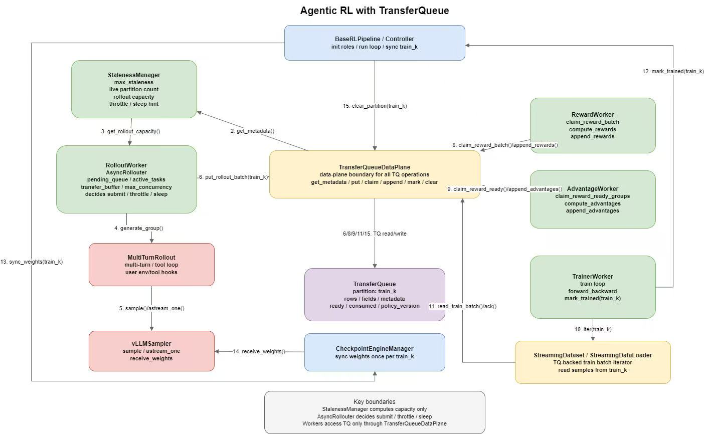

# 基于 TransferQueue 的 Agentic RL 总体设计

## 当前基线

`grpo_baseline.py` 的核心流程是同步 batch-blocking：

```python
expand_prompts = [p for prompt in batch for p in [prompt] * NUM_GENERATIONS]

ckpt_manager.sync_weights(merge_and_sync=False)
sampler.reset_prefix_cache()

all_trajectories = rollout(expand_prompts)
total_rewards, f1_rewards, cot_rewards = compute_rewards(all_trajectories)
advantages = GRPOAdvantage()(total_rewards, num_generations=NUM_GENERATIONS, scale="group")

for mini_batch in all_trajectories:
    ref_logps = model.forward_only(..., disable_lora=True)
    model.forward_backward(
        inputs=mini_batch,
        old_logps=old_logps,
        advantages=advantages,
        ref_logps=ref_logps,
    )
    model.clip_grad_and_step()
```

这个流程有三个问题：

- `rollout(expand_prompts)` 要等整个 expanded batch 完成后才返回，快完成的 prompt group 不能提前进入训练数据系统。
- rollout、reward、advantage、trainer 在同一个 driver loop 中串行运行，无法自然 overlap。
- 权重同步、staleness、长尾任务取消等控制逻辑没有独立抽象，难以切换同步/异步模式。

## 总体架构图

架构图使用 draw.io 维护，文件位置：



该图以 `TransferQueueDataPlane` 为中心，表达所有组件通过统一数据面访问 `TransferQueue` 的关系。`TransferQueue` 只作为 data plane 下方的数据存储依赖，不作为架构中心节点。

图中连线标签的数字表示一个 `train_k` 生命周期内的主要发生顺序：

```text
1.  BaseRLPipeline 初始化 TransferQueueDataPlane。
2.  TransferQueueDataPlane 读取 TQ metadata。
3.  StalenessManager 根据 metadata 计算 rollout capacity / throttle hint。
4.  AsyncRollouter 调用 MultiTurnRollout 生成 prompt group。
5.  MultiTurnRollout 调用 vLLMSampler 生成模型响应。
6.  AsyncRollouter 将 rollout batch 写入 train_k。
8.  RewardWorker 消费 rollout-ready 数据并写回 rewards。
9.  AdvantageWorker 消费 reward-ready group 并写回 advantages / returns。
10. TrainerWorker 通过 StreamingDataset / StreamingDataLoader 迭代 train_k。
11. StreamingDataset / StreamingDataLoader 通过 TransferQueueDataPlane 读取训练 batch 并 ack。
12. TrainerWorker 完成 train_k 后通知 BaseRLPipeline。
13. BaseRLPipeline 触发 sync_weights(train_k)。
14. CheckpointEngineManager 将权重同步到 vLLMSampler。
15. BaseRLPipeline 通过 TransferQueueDataPlane 清理 train_k。
```

## 关键边界

- `TransferQueueDataPlane` 是独立组件，是所有组件访问 TransferQueue 的唯一数据面边界；rollouter、worker、pipeline 不直接调用底层 TQ API。
- 异步 RL 必须支持 multi-tenant / multi-LoRA 隔离；所有 TQ partition、metadata、claim/read/ack、权重同步都必须带上 `tenant_id / training_run_id / adapter_name` 作用域。
- `TransferQueue` 容量在 pipeline 初始化阶段按 `samples_per_partition * (max_staleness + 1)` 规划；`samples_per_partition = partition.target_groups * rollout.num_generations`。
- `TransferQueue` 的 `task_name` 用于区分 `rollout`、`reward`、`advantage`、`train` 四个数据处理阶段，不等价于 worker 名字。
- `StalenessManager` 只根据 `max_staleness` 和 TransferQueue metadata 计算 rollout capacity / staleness 状态，不直接提交 rollout task，也不控制 reward、advantage、train 的消费额度或权重同步。
- `AsyncRollouter` 结合 `StalenessManager` 返回的 capacity、配置文件中的最大并发数、当前 `active_tasks`、`pending_queue` 和 `transfer_buffer` 状态，决定是否提交新的 rollout task；如果 staleness 接近上限则减缓提交速率，如果超过安全范围则 sleep/backoff。
- `RewardWorker`、`AdvantageWorker` 是长期运行的 TransferQueue 消费者，按各自配置的 batch size 通过 `TransferQueueDataPlane` claim ready 数据。
- `TrainerWorker` 通过 `StreamingDataset / StreamingDataLoader` 从 `train_k` 读取训练 batch；dataset/dataloader 内部通过 `TransferQueueDataPlane` 访问 TQ，并在训练完成后配合标记 `mark_trained(train_k)`。
- 权重同步固定为每个 rollout step / `train_k` 完成后同步一次，由 `BaseRLPipeline` 调用 `CheckpointEngineManager` 执行。
- `TransferQueue` 是数据协议中心，承载 rows、fields、metadata、partition 生命周期和消费状态。
- `AsyncRollouter` 只负责 prompt group 级 rollout 生产，不计算 reward、advantage 或 optimizer step。
