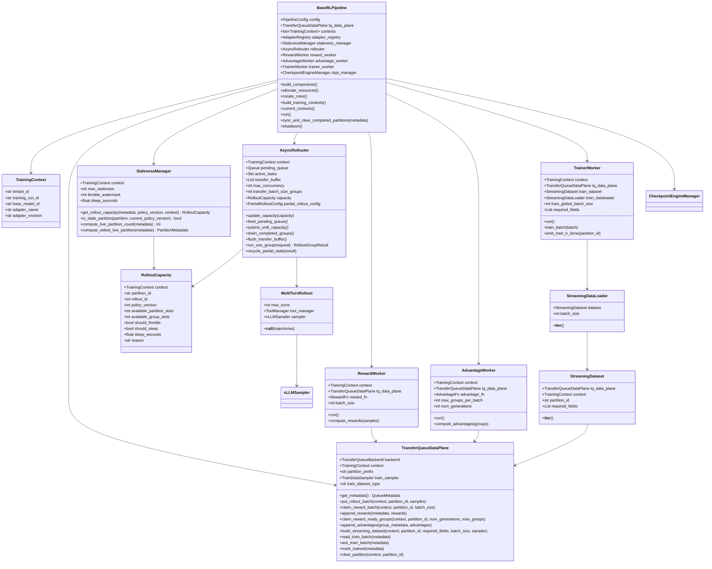
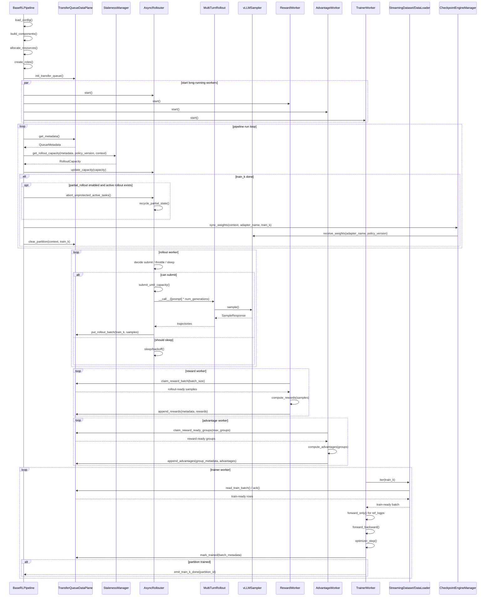

# 基于 TransferQueue 的 Agentic RL 详细设计

## 0. 概念澄清

### 0.1 组件边界

本设计中的核心组件分为五类：

```text
BaseRLPipeline:
  训练编排入口，负责初始化组件、创建角色、驱动主循环、管理一个或多个 TrainingContext，
  并处理 train_k done 后的权重同步和 partition 清理。

TransferQueueDataPlane:
  独立的 TQ 数据面组件。所有组件都通过它访问 TransferQueue，不直接调用底层 TQ API。

StalenessManager:
  只负责根据 TQ metadata 和 max_staleness 计算 rollout capacity / throttle / sleep hint。
  它不提交 rollout task，不控制 reward/advantage/train 消费额度，也不控制权重同步。

AsyncRollouter:
  rollout 生产运行时。它结合 StalenessManager 返回的 capacity、配置最大并发数、active_tasks、pending_queue、transfer_buffer，自行决定 submit / throttle / sleep。

RewardWorker / AdvantageWorker:
  长期运行的 TQ 消费者。它们按各自配置的 batch size 通过 TransferQueueDataPlane claim ready 数据。

TrainerWorker:
  训练执行组件。它通过 StreamingDataset / StreamingDataLoader 迭代 train_k，
  dataset/dataloader 底层通过 TransferQueueDataPlane 访问 TransferQueue。
```

### 0.2 数据单位

```text
prompt group:
  一个 prompt 对应 rollout.num_generations 条 trajectories。
  GRPO advantage 默认以 prompt group 为单位计算。

trajectory sample:
  TransferQueue 中的一行样本。

transfer batch:
  AsyncRollouter 将若干 ready prompt groups 聚合后，一次写入 TransferQueue。

tenant / training_run / adapter:
  多租户和 multi-LoRA 的隔离作用域。
  tenant_id 区分业务租户，training_run_id 区分一次训练任务，adapter_name 区分 LoRA adapter。
  第一版要求所有 partition、claim/read/ack、权重同步都在这个作用域内执行。

partition / train_k:
  一个 rollout step 的数据生命周期单位。
  一个 train_k 内部可以多次 append rollout-ready rows。

policy_version:
  rollout 使用的参数版本。
  它是 sample 级 metadata，不是 train_k 的唯一键。

policy_version / train_k / partition 的关系:
  一个 train_k 只能对应一个 TransferQueue partition。
  一个 partition 可以累积多个 prompt group，直到 ready_groups >= target_groups_per_partition。
  一个 train_k 可以包含多个 policy_version 的 rows。
  每条 row 必须保留自己的 policy_version / adapter_revision / old_logps。
  partition seal 后不能继续追加 rollout rows。
```

### 0.3 同步与 staleness

```text
权重同步:
  每个 train_k 训练完成后同步一次。
  BaseRLPipeline 调用 CheckpointEngineManager，同步完成后 clear_partition(train_k)。

staleness 控制:
  StalenessManager 只计算 rollout capacity。
  AsyncRollouter 根据 capacity 决定是否继续提交 rollout task。

mixed-version batch:
  第一版允许同一个 train_k 内出现多个 policy_version。
  Trainer batch 必须来自同一个 train_k / tenant / training_run / adapter。
  loss 计算必须使用 row 自己携带的 old_logps 和 policy_version 元数据，不允许用当前最新版本覆盖。

multi-tenant / multi-LoRA:
  第一版支持多个 tenant / adapter 共享底层服务，但不允许跨 tenant、跨 training_run、跨 adapter 混 batch。
  每个 adapter 独立维护 policy_version、staleness、partition 生命周期和权重同步。
```

### 0.4 TransferQueueDataPlane 的定位

`TransferQueueDataPlane` 是独立组件，是所有 TQ 操作的唯一数据面入口：

```text
BaseRLPipeline:
  get_metadata()
  clear_partition(train_k)

AsyncRollouter:
  put_rollout_batch(train_k)

RewardWorker:
  claim_reward_batch()
  append_rewards()

AdvantageWorker:
  claim_reward_ready_groups()
  append_advantages()

TrainerWorker:
  iter(train_k) through StreamingDataset / StreamingDataLoader
  mark_trained()
```

## 1. 类图设计

### 1.1 总体类图



### 1.2 Metadata 类

```python
@dataclass
class TrainingContext:
    tenant_id: str
    training_run_id: str
    base_model_id: str
    adapter_name: str
    adapter_revision: str | None = None


@dataclass
class QueueMetadata:
    context: TrainingContext
    active_partitions: list[PartitionMetadata]
    total_bytes: int | None
    trainer_step: int
    current_policy_version: int


@dataclass
class PartitionMetadata:
    context: TrainingContext
    partition_id: str
    rollout_id: int
    policy_version: int
    target_groups: int
    rollout_done_groups: int
    reward_done_groups: int
    advantage_done_groups: int
    trained_groups: int
    dropped_groups: int
    is_rollout_done: bool
    is_train_done: bool
```

### 1.3 Rollout 数据类

```python
@dataclass
class RolloutGroupRequest:
    context: TrainingContext
    prompt: Trajectory
    rollout_id: int
    partition_id: str
    group_id: str
    num_generations: int
    policy_version: int
    partial_state: dict | None = None
    abort_count: int = 0
    protected: bool = False


@dataclass
class RolloutGroupResult:
    request: RolloutGroupRequest
    trajectories: list[Trajectory]
    status: str  # ok / timeout / aborted / failed
    partial_state: dict | None = None
    error: str | None = None


@dataclass
class PartialRolloutConfig:
    enabled: bool = False
    max_aborted_count: int = 3
    mask_offpolicy_tokens: bool = True
```

### 1.4 训练数据读取类

```python
class StreamingDataset:
    def __init__(
        self,
        data_plane: TransferQueueDataPlane,
        partition_id: str,
        required_fields: list[str],
    ):
        ...

    def __iter__(self):
        ...


class StreamingDataLoader:
    """基于 StreamingDataset 形成训练 batch 迭代器。"""

    def __iter__(self):
        ...
```

`TrainerWorker` 不直接从 TQ claim train batch，而是通过 `StreamingDataset / StreamingDataLoader` 迭代训练数据；dataset/dataloader 内部再通过 `TransferQueueDataPlane` 调用底层 TQ 的 reader / ack 能力。

## 2. 异步 RL 编排时序图



## 3. TransferQueue 初始化与数据命名

### 3.1 容量初始化

TransferQueue 的容量需要在 `BaseRLPipeline / Controller` 初始化阶段确定，原则是按允许同时存活的 `train_k` partition 数规划，而不是按单个 sample 动态扩容。

第一版采用 Relax-style partition 级 staleness：

```text
max_live_partitions = max_staleness + 1
```

一个 `train_k` 的目标样本数由配置决定：

```text
samples_per_partition =
  partition.target_groups * rollout.num_generations
```

因此 TQ 的逻辑容量可以按下面方式初始化：

```text
max_rows =
  samples_per_partition * max_live_partitions

max_tq_bytes =
  estimate_bytes_per_sample * max_rows * safety_factor
```

其中：

```text
partition.target_groups:
  一个 train_k 目标收集多少个 prompt group。

rollout.num_generations:
  每个 prompt group 中包含多少条 trajectory sample。

max_staleness:
  rollout 最多领先 trainer 的未完成 train_k 数。

max_live_partitions:
  TQ 中最多同时存在多少个未清理 train_k。
```

如果 TransferQueue backend 支持按 bytes 初始化，则优先使用 `max_tq_bytes`；如果 backend 只支持 row / object 数，则使用 `max_rows` 或等价的 partition capacity。`max_tq_bytes` 不是新的调度条件，它是资源保护阈值；真正的 rollout 背压仍由 `StalenessManager` 根据 live partition 数和 metadata 计算。

multi-tenant / multi-LoRA 场景下，容量需要同时有全局上限和作用域上限：

```text
global_max_rows:
  整个 TransferQueue backend 的总 row 上限。

context_max_rows:
  单个 (tenant_id, training_run_id, adapter_name) 的 row 上限。

context_max_live_partitions:
  单个 (tenant_id, training_run_id, adapter_name) 的 live train_k 上限。
  默认等于 max_staleness + 1。
```

`StalenessManager` 使用 context 内的 live partitions 计算 capacity；`TransferQueueDataPlane` 负责执行全局和 context 级容量保护，防止一个 tenant / adapter 占满整个 TQ。

### 3.2 partition_id

`partition_id` 是 rollout step 的数据生命周期单位：

```text
rollout step k -> partition_id = train_k
```

为了支持 multi-tenant / multi-LoRA，物理 partition key 必须带作用域前缀，避免不同 tenant 或 adapter 的 `train_k` 冲突：

```text
logical partition_id:
  train_k

physical partition key:
  tenant_id/training_run_id/adapter_name/train_k
```

文档中仍使用 `train_k` 表达逻辑生命周期；具体 TQ backend 写入时由 `TransferQueueDataPlane` 负责拼接 physical key。

第一版要求：

```text
一个 train_k 对应一个 TransferQueue partition。
Trainer batch 可以包含同一个 train_k 内的多个 policy_version rows。
Trainer batch 只从同一个 tenant_id / training_run_id / adapter_name 读取。
```

### 3.3 task_name

`task_name` 是 TransferQueue 内部区分数据处理阶段的逻辑名字，不等价于 worker 名字。它用于标识某个字段由哪个阶段产生、哪个阶段消费，以及某一批 rows 当前处于哪个阶段的 ready / claimed / consumed 状态。

建议第一版固定使用四类 `task_name`：

| task_name | 写入/消费阶段 | 主要字段 |
|---|---|---|
| `rollout` | `AsyncRollouter` 写入初始 trajectory rows | `input_ids`、`labels`、`old_logps`、`messages`、`turns`、`group_id`、`generation_idx`、`policy_version` |
| `reward` | `RewardWorker` 消费 rollout-ready rows 并写回 reward | `rewards`、`raw_rewards`、`reward_breakdown` |
| `advantage` | `AdvantageWorker` 消费 reward-ready groups 并写回 advantage | `advantages`、`returns` |
| `train` | `StreamingDataset / StreamingDataLoader` 消费 train-ready rows | training read state、ack state、`trained` |

典型数据流：

```text
put(partition_id=train_k, task_name=rollout, fields=rollout_fields)
claim(partition_id=train_k, task_name=reward, required_fields=rollout_fields)
append(partition_id=train_k, task_name=reward, fields=reward_fields)
claim(partition_id=train_k, task_name=advantage, required_fields=reward_fields)
append(partition_id=train_k, task_name=advantage, fields=advantage_fields)
read(partition_id=train_k, task_name=train, required_fields=train_required_fields)
ack(partition_id=train_k, task_name=train)
clear_partition(train_k)
```

这里的 `claim` 表示“读取并认领一批 ready rows / groups”，避免多个同类 worker 重复处理同一批数据；`read / ack` 更适合 trainer 的 StreamingDataLoader 语义。

所有 `claim / read / ack / append / clear` 必须携带 `TrainingContext` 过滤条件：

```text
claim(context, partition_id=train_k, task_name=reward, ...)
read(context, partition_id=train_k, task_name=train, ...)
clear_partition(context, partition_id=train_k)
```

禁止跨 context claim 数据；这是 multi-tenant 隔离和 multi-LoRA 训练正确性的硬约束。

### 3.4 multi-tenant / multi-LoRA 字段约束

每一行 trajectory sample 至少需要带以下隔离字段：

```text
tenant_id
training_run_id
base_model_id
adapter_name
adapter_revision
policy_version
partition_id
group_id
generation_idx
```

字段含义：

| 字段 | 含义 |
|---|---|
| `tenant_id` | 业务租户，用于资源、数据和权限隔离 |
| `training_run_id` | 一次 RL 训练任务的唯一 ID |
| `base_model_id` | LoRA 所依附的 base model |
| `adapter_name` | 当前训练的 LoRA adapter 名称 |
| `adapter_revision` | adapter 权重版本或 checkpoint 标识，可选 |
| `policy_version` | rollout 使用的 actor/adapter 参数版本 |

第一版不支持一个 trainer batch 混合多个 `adapter_name`。同一个 `train_k` 或 trainer batch 可以包含多个 `policy_version`，但每条 row 必须保留自己的 `policy_version / adapter_revision / old_logps`，loss 计算不能用当前最新版本覆盖这些 row-level metadata。

## 4. Staleness 控制

### 4.1 输入与输出

`StalenessManager` 输入：

```text
QueueMetadata
current_policy_version
max_staleness
TrainingContext
```

`StalenessManager` 输出：

```python
@dataclass
class RolloutCapacity:
    partition_id: str
    rollout_id: int
    policy_version: int
    available_partition_slots: int
    available_group_slots: int
    should_throttle: bool
    should_sleep: bool
    sleep_seconds: float
    reason: str
```

### 4.2 控制原则

第一版采用 Relax-style partition 级 staleness：

```text
max_live_partitions = max_staleness + 1
```

判断逻辑：

```text
active_partitions = metadata.active_partitions  # 已按 TrainingContext 过滤
oldest_live_partition = min(active_partitions.rollout_id)
live_partition_count = len(active_partitions)

if live_partition_count >= max_staleness + 1:
    available_partition_slots = 0
else:
    available_partition_slots = max_staleness + 1 - live_partition_count
```

`AsyncRollouter` 不直接使用这个值提交 task，而是结合本地状态：

```text
can_submit =
  capacity.available_partition_slots > 0
  and len(active_tasks) < max_concurrency
  and not capacity.should_sleep
  and pending_queue is not empty
```

### 4.3 throttle / sleep

建议将 staleness 控制分成三档：

```text
normal:
  live_partition_count < max_staleness + 1
  AsyncRollouter 正常提交，受 max_concurrency 限制。

throttle:
  live_partition_count 接近上限，或 TQ bytes 接近保护阈值。
  AsyncRollouter 降低提交速率，例如减少每轮 submit 数或增加短 sleep。

sleep:
  live_partition_count >= max_staleness + 1
  或 oldest train_k 长时间未训练完成。
  AsyncRollouter 暂停提交新 rollout task，等待 trainer clear partition。
```

### 4.4 与权重同步的关系

`StalenessManager` 不控制权重同步。

权重同步固定发生在：

```text
TrainerWorker 完成 train_k
  -> BaseRLPipeline.sync_weights(context, adapter_name, train_k)
  -> CheckpointEngineManager
  -> vLLMSampler.receive_weights(adapter_name, policy_version)
  -> TransferQueueDataPlane.clear_partition(context, train_k)
```

partition 被 clear 后，下一次 `get_metadata(context)` 会反映该 context 内 active partition 数减少，`StalenessManager` 计算出的 capacity 自然变大。

multi-LoRA 场景下，权重同步只同步当前 `adapter_name` 对应的 LoRA adapter 权重，不影响同一 base model 上的其他 adapter。`policy_version` 是 adapter 级版本：

```text
(tenant_id, training_run_id, adapter_name) -> policy_version
```

如果多个 tenant / adapter 共享同一个 `vLLMSampler` 或 rollout engine，`receive_weights()` 必须携带 `adapter_name` 和 `policy_version`，后续 rollout request 也必须显式指定同一个 `adapter_name`。

### 4.5 partial rollout

当 `partial_rollout.enabled = true`，并且 train_k done 触发权重同步时：

```text
BaseRLPipeline 通知 AsyncRollouter:
  abort_unprotected_active_tasks()

AsyncRollouter:
  导出 partial_state
  abort_count += 1
  如果 abort_count >= max_aborted_count，则 protected = true
  将 partial request 放回 pending_queue
```

续跑后的 sample 写入当前 train_k / policy_version。旧版本 token 只作为上下文：

```text
loss_mask[:offpolicy_token_count] = 0
loss_mask[offpolicy_token_count:] = 1
```

partial rollout 状态必须保存 `TrainingContext`。中断续跑时，只允许把 partial state 交回同一个 `tenant_id / training_run_id / adapter_name`，不能跨 tenant 或跨 adapter 续跑。

## 5. 用户定制钩子

### 5.1 自定义 rollout 产生流程

如果用户有全新的 agentic 训练任务，通常只需要继承 rollout 相关类，不需要修改 pipeline。

可定制点：

```python
class CustomRollout(MultiTurnRollout):
    def build_initial_messages(self, prompt: Trajectory) -> list[dict]:
        ...

    def parse_model_response(self, response_text: str) -> dict:
        ...

    def execute_tool_or_env_step(self, parsed_response: dict) -> dict:
        ...

    def build_next_observation(self, tool_result: dict) -> dict:
        ...

    def should_stop(self, state: dict) -> bool:
        ...
```

适用场景：

```text
Code Agent:
  模型生成代码 -> sandbox 执行 -> 解析 stdout/stderr/test result -> 下一轮 observation

Visual Tool Agent:
  模型生成 zoom/rotate/crop tool call -> env 执行 -> 返回图像 observation

Search Agent:
  模型生成检索 query -> tool manager 调用搜索 API -> 返回片段 -> 下一轮回答
```

### 5.2 自定义 env/tool

如果任务需要复杂环境状态，建议提供 `BaseInteractionEnv`：

```python
class BaseInteractionEnv:
    def reset(self, prompt: Trajectory) -> tuple[dict, dict]:
        ...

    def step(self, response_text: str) -> tuple[dict, bool, dict]:
        ...

    def format_observation(self, observation: dict) -> Trajectory:
        ...
```

边界：

```text
env/tool 负责交互过程。
reward 仍然由 RewardWorker 计算。
env 不直接写 TransferQueue。
```

### 5.3 自定义 reward / advantage

```python
class RewardFn:
    def __call__(self, samples: list[dict]) -> list[dict]:
        ...


class AdvantageFn:
    def __call__(self, groups: list[list[dict]]) -> list[list[float]]:
        ...
```

GRPO 默认要求 group 完整：

```text
(partition_id, group_id)
  -> num_generations 条 samples
  -> rewards ready
  -> compute group-relative advantages
```

### 5.4 自定义 trainer batch 读取

如果默认 `StreamingDataset / StreamingDataLoader` 不满足需求，可以替换训练数据迭代器：

```python
class CustomStreamingDataset(StreamingDataset):
    def __iter__(self):
        ...
```

可定制策略：

```text
length-balanced batch
rank-aware streaming batch
GRPO group-complete sampler
custom StreamingDataLoader collate / prefetch
```

约束：

```text
第一版 batch 必须来自同一个 train_k。
第一版 batch 必须来自同一个 tenant_id / training_run_id / adapter_name。
第一版 batch 可以包含多个 policy_version，但每条 row 必须带自己的 old_logps。
不能绕过 TransferQueueDataPlane 直接访问底层 TQ。
```

### 5.5 自定义 staleness 策略

```python
class CustomStalenessManager(StalenessManager):
    def get_rollout_capacity(
        self,
        metadata: QueueMetadata,
        policy_version: int,
        context: TrainingContext,
    ) -> RolloutCapacity:
        ...
```

可定制内容：

```text
throttle watermark
sleep_seconds
TQ bytes 保护阈值
oldest partition 等待时间阈值
rollout capacity 计算方式
```

不可定制越界：

```text
不保存 sample payload。
不实现 replay buffer。
不控制 reward/advantage/train 消费额度。
不控制权重同步。
```

### 5.6 自定义编排流程

如果要新增完整算法流程，可以继承 `BaseRLPipeline`。

需要重写的方法：

```python
class CustomRLPipeline(BaseRLPipeline):
    def build_components(self) -> None:
        """创建 model、sampler、rollout、reward、advantage、trainer、TQ data plane、manager。"""

    def allocate_resources(self) -> None:
        """分配 DeviceMesh、remote workers、TransferQueue backend。"""

    def create_roles(self) -> None:
        """创建 RolloutWorker、RewardWorker、AdvantageWorker、TrainerWorker。"""

    def run(self) -> None:
        """如需改变主循环，重写 run；默认主循环已覆盖 GRPO async pipeline。"""

    def sync_and_clear_completed_partitions(self, metadata: QueueMetadata) -> None:
        """控制 train_k done 后的 sync weights 与 clear partition。"""

    def should_stop(self) -> bool:
        """定义训练终止条件。"""
```

通常不建议重写：

```text
TransferQueueDataPlane 底层读写协议
TransferQueue row/field schema
StalenessManager 的 sample payload 访问边界
```

### 5.7 用户最小接入面

普通新任务一般只需要提供：

```text
1. Dataset / processor
2. Rollout prompt template
3. MultiTurnRollout 子类或 BaseInteractionEnv
4. ToolManager / sandbox / external tool adapter
5. RewardFn
6. YAML 配置
```

算法级扩展才需要改：

```text
AdvantageFn
StreamingDataset / StreamingDataLoader
TrainerWorker
StalenessManager
BaseRLPipeline
```

## 6. 参数配置示例

下面是一个 GRPO + agentic multi-turn rollout + TransferQueue 的 YAML 示例。字段名用于表达设计意图，实际落地时可以按 Twinkle 现有配置系统调整层级。

```yaml
pipeline:
  class: AsyncAgenticGRPOPipeline
  max_steps: 1000
  log_interval: 10
  save_interval: 100

tenant:
  tenant_id: default
  training_run_id: grpo_run_001

adapter:
  base_model_id: ms://Qwen/Qwen3.5-4B
  adapter_name: grpo_lora_default
  adapter_revision: null
  multi_lora: true

model:
  class: MegatronModel
  model_id: ms://Qwen/Qwen3.5-4B
  loss: GRPOLoss
  metric: GRPOMetric

sampler:
  class: vLLMSampler
  engine_args:
    max_model_len: 32768
    enable_lora: true
    max_lora_rank: 32

transfer_queue:
  data_plane_class: TransferQueueDataPlane
  partition_prefix: "{tenant_id}/{training_run_id}/{adapter_name}/train"
  backend: auto
  task_names:
    rollout: rollout
    reward: reward
    advantage: advantage
    train: train
  capacity:
    estimate_bytes_per_sample: auto
    safety_factor: 1.2
    max_rows: auto                    # target_groups * num_generations * (max_staleness + 1)
    max_tq_bytes: null                # 可选保护阈值；为 null 时由 max_rows 和样本估算得到
  train_reader: streaming_dataloader
  sampler: grpo_group

staleness:
  manager_class: StalenessManager
  max_staleness: 1                   # 最多允许 rollout 领先 trainer 的未完成 train_k 数
  throttle_watermark: 0.8            # 接近上限时降低 rollout submit 速率
  sleep_seconds: 1.0                 # 超过安全范围时 AsyncRollouter 的 sleep/backoff 时间

partition:
  target_groups: 128                 # 一个 train_k 目标收集多少个 prompt group

rollout_worker:
  class: RolloutWorker
  runtime: AsyncRollouter
  queue_size: 128
  max_concurrency: auto
  transfer_batch_size_groups: auto
  group_timeout_s: 600
  max_retries: 1

rollout:
  class: MultiTurnRollout
  max_turns: 6
  num_generations: 8
  max_trajectory_tokens: null
  env_class: null                    # 可替换为自定义 BaseInteractionEnv
  tool_manager_class: ToolManager

partial_rollout:
  enabled: false
  max_aborted_count: 3
  mask_offpolicy_tokens: true

reward_worker:
  class: RewardWorker
  batch_size: 64
  reward_fn:
    class:
      - F1Reward
      - CoTReward
    weights:
      f1: 1.0
      cot: 0.2

advantage_worker:
  class: AdvantageWorker
  advantage_fn: GRPOAdvantage
  max_groups_per_batch: 32
  scale: group

trainer_worker:
  class: TrainerWorker
  train_global_batch_size: 64
  micro_batch_size: 2
  gradient_accumulation_steps: 1
  required_fields:
    - input_ids
    - labels
    - old_logps
    - advantages
    - loss_mask
  ref_logps:
    mode: trainer_forward_only
    disable_lora: true
  kl_beta: 0.02

checkpoint:
  engine: HCCLCheckpointEngine       # 或 NCCLCheckpointEngine
  sync_on_train_k_done: true         # 第一版固定语义：每个 train_k 完成后同步一次
  merge_and_sync: false
  sync_context: adapter                # multi-LoRA 场景只同步当前 adapter_name

custom_hooks:
  rollout_class: null                # 自定义 rollout 产生流程
  env_class: null                    # 自定义环境交互
  reward_fn_class: null              # 自定义 reward
  advantage_fn_class: null           # 自定义 advantage
  streaming_dataset_class: null      # 自定义 trainer 训练数据读取策略
  staleness_manager_class: null      # 自定义 staleness 策略
```

关键参数含义：

| 参数 | 含义 |
|---|---|
| `partition.target_groups` | 一个 `train_k` 目标收集的 prompt group 数 |
| `rollout.num_generations` | 每个 prompt 生成多少条 trajectory，GRPO 默认按这个 group 计算 advantage |
| `tenant.tenant_id` | 多租户隔离 ID，TQ claim/read/ack 和资源配额必须按它过滤 |
| `tenant.training_run_id` | 一次训练任务的唯一 ID，避免同一 tenant 下多个训练任务互相污染 |
| `adapter.adapter_name` | 当前训练的 LoRA adapter 名称，TQ partition、policy_version、权重同步都按它隔离 |
| `adapter.multi_lora` | 是否启用 multi-LoRA 共享服务模式；启用后 rollout request 和 receive_weights 必须携带 adapter_name |
| `transfer_queue.task_names` | TQ 内部区分 `rollout` / `reward` / `advantage` / `train` 阶段的逻辑名字 |
| `transfer_queue.capacity.max_rows` | TQ 初始化 row 容量，默认按 `target_groups * num_generations * (max_staleness + 1)` 计算 |
| `transfer_queue.capacity.max_tq_bytes` | TQ 初始化 bytes 容量或保护阈值，可由样本估算得到 |
| `rollout_worker.max_concurrency` | `AsyncRollouter` 同时运行的 prompt group task 上限 |
| `rollout_worker.transfer_batch_size_groups` | 每次写入 TQ 的 ready group 数 |
| `staleness.max_staleness` | rollout 最多领先 trainer 的未完成 `train_k` 数 |
| `staleness.throttle_watermark` | 接近 staleness 上限时触发降速 |
| `partial_rollout.enabled` | 是否启用中断回收和续跑 |
| `transfer_queue.train_reader` | trainer 侧使用的训练数据迭代器，第一版默认 StreamingDataLoader |
| `trainer_worker.required_fields` | StreamingDataset / StreamingDataLoader 读取训练 batch 时必须 ready 的字段 |
| `checkpoint.sync_on_train_k_done` | 每个 `train_k` 完成后同步一次权重，第一版固定为 true |

## 7. 三人开发分工

建议按数据面、rollout/staleness、trainer/pipeline 三条边界拆分。三个人之间通过 `TransferQueueDataPlane` 接口、`train_k` partition schema 和 YAML 配置对齐，避免互相阻塞。

### 7.1 开发者 A：TransferQueueDataPlane 与数据协议，trainer scheculer,adaper registry

负责范围：

```text
TransferQueueDataPlane
TransferQueue 初始化
partition / task_name / field schema
metadata 查询
claim / append / read / ack / clear_partition
StreamingDataset / StreamingDataLoader 的底层 TQ 访问适配
```

主要产出：

- 实现 `TransferQueueDataPlane`，封装底层 TQ API。
- 实现 TQ 容量初始化：`target_groups * num_generations * (max_staleness + 1)`。
- 固化 `task_name = rollout / reward / advantage / train`。
- 固化 `TrainingContext = tenant_id / training_run_id / adapter_name`，所有 TQ 操作必须按 context 过滤。
- 定义 `QueueMetadata`、`PartitionMetadata`、row 字段 schema。
- 提供 mock / local backend，方便其他开发者不依赖真实 TQ 调试。

接口交付：

```python
class TransferQueueDataPlane:
    def init_queue(self, config): ...
    def get_metadata(self) -> QueueMetadata: ...
    def put_rollout_batch(self, context: TrainingContext, partition_id: str, samples: list[dict]): ...
    def claim_reward_batch(self, context: TrainingContext, partition_id: str, batch_size: int): ...
    def append_rewards(self, metadata, rewards): ...
    def claim_reward_ready_groups(self, context: TrainingContext, partition_id: str, num_generations: int, max_groups: int): ...
    def append_advantages(self, group_metadata, advantages): ...
    def build_streaming_dataset(self, context: TrainingContext, partition_id: str, required_fields: list[str], batch_size: int, sampler): ...
    def mark_trained(self, metadata): ...
    def clear_partition(self, context: TrainingContext, partition_id: str): ...
```

验收标准：

- 能独立运行 unit test，验证同一个 sample 不会被多个 reward / advantage worker 重复 claim。
- 能通过 mock TQ 完成 `rollout -> reward -> advantage -> train -> clear` 的字段状态流转。
- metadata 能正确反映 live partitions、最老 partition、各阶段完成进度。

### 7.2 开发者 B：AsyncRollouter、StalenessManager 与多轮交互 rollout scheduler

负责范围：

```text
AsyncRollouter
StalenessManager
MultiTurnRollout 接入
prompt group 级并发
transfer_buffer
partial rollout 状态保存与恢复
env/tool 自定义钩子
```

主要产出：

- 实现 `StalenessManager.get_rollout_capacity()`。
- 实现 `AsyncRollouter` 的 `pending_queue / active_tasks / transfer_buffer`。
- 按 capacity、`max_concurrency`、`pending_queue`、`active_tasks` 决定 submit / throttle / sleep。
- rollout request 必须携带 `adapter_name / policy_version`，保证 multi-LoRA 共享 sampler 时路由到正确 adapter。
- 将 ready prompt groups 分批写入 `TransferQueueDataPlane.put_rollout_batch(train_k)`。
- 在 partial rollout 场景保存 `pif / messages / turns / abort_count / policy_version`，复用现有 bridge token 逻辑满足 TITO 能力。
- 提供自定义 `MultiTurnRollout`、env/tool 交互流程的扩展点。

接口交付：

```python
class StalenessManager:
    def get_rollout_capacity(self, metadata: QueueMetadata, policy_version: int, context: TrainingContext) -> RolloutCapacity: ...

class AsyncRollouter:
    def update_capacity(self, capacity: RolloutCapacity): ...
    async def feed_pending_queue(self): ...
    async def submit_until_capacity(self): ...
    async def drain_completed_groups(self): ...
    async def flush_transfer_buffer(self): ...
    async def run_one_group(self, request: RolloutGroupRequest) -> RolloutGroupResult: ...
```

验收标准：

- `max_staleness=0` 时，最多只允许一个 live `train_k`。
- `max_staleness=N` 时，live partitions 不超过 `N + 1`。
- trainer 不清理旧 partition 时，rollout 能 throttle / sleep。
- trainer 清理 partition 后，rollout 能继续提交新 task。
- 多轮 tool 交互能保持 `input_ids / labels / messages / old_logps` 对齐。

### 7.3 开发者 C：BaseRLPipeline、Reward/Advantage/Trainer 与权重同步

负责范围：

```text
BaseRLPipeline
RewardWorker
AdvantageWorker
TrainerWorker
StreamingDataset / StreamingDataLoader 使用侧
GRPO 数据消费
CheckpointEngineManager 权重同步
YAML 配置装配
```

主要产出：

- 实现 `BaseRLPipeline` 的组件初始化、资源分配、角色创建和主循环。
- 启动 `AsyncRollouter / RewardWorker / AdvantageWorker / TrainerWorker`。
- 实现 reward / advantage worker 对 TQ ready 数据的消费和写回。
- 实现 trainer 通过 `StreamingDataset / StreamingDataLoader` 读取 `train_k`，并执行 GRPO 训练。
- 在 `train_k` 完成后触发：

```text
BaseRLPipeline.sync_weights(context, adapter_name, train_k)
  -> CheckpointEngineManager
  -> vLLMSampler.receive_weights(adapter_name, policy_version)
  -> TransferQueueDataPlane.clear_partition(context, train_k)
```

- 打通 YAML 配置到各组件构造。

接口交付：

```python
class BaseRLPipeline:
    def build_components(self): ...
    def allocate_resources(self): ...
    def create_roles(self): ...
    def run(self): ...
    def sync_and_clear_completed_partitions(self, metadata: QueueMetadata): ...

class RewardWorker:
    def run(self): ...

class AdvantageWorker:
    def run(self): ...

class TrainerWorker:
    def run(self): ...
```

验收标准：

- 能跑通一个最小 GRPO async pipeline。
- `train_k` 内 batch 来自同一个 `tenant_id / training_run_id / adapter_name`。
- `train_k` 内 mixed policy_version rows 保留各自的 `policy_version / old_logps`。
- 每个 `train_k` 训练完成后只同步一次权重。
- 权重同步完成后才 `clear_partition(train_k)`。
- 支持通过 YAML 切换 reward、advantage、rollout、staleness 的自定义类。

### 7.4 联调顺序

建议按以下顺序联调：

```text
1. A 先交付 mock TransferQueueDataPlane。
2. B 用 mock data plane 验证 rollout 写入、staleness、backpressure。
3. C 用 mock data plane 验证 reward / advantage / trainer 消费。
4. A 替换真实 TransferQueue backend。
5. 三方联调一个 train_k 的完整生命周期。
6. 打开 max_staleness > 0，验证 rollout/trainer overlap。
7. 最后验证 partial_rollout。
```

最小端到端验收流：

```text
BaseRLPipeline init
  -> AsyncRollouter put train_0
  -> RewardWorker append rewards
  -> AdvantageWorker append advantages
  -> TrainerWorker train train_0
  -> BaseRLPipeline sync weights
  -> clear_partition(train_0)
  -> StalenessManager 释放 capacity
  -> AsyncRollouter put train_1
```
